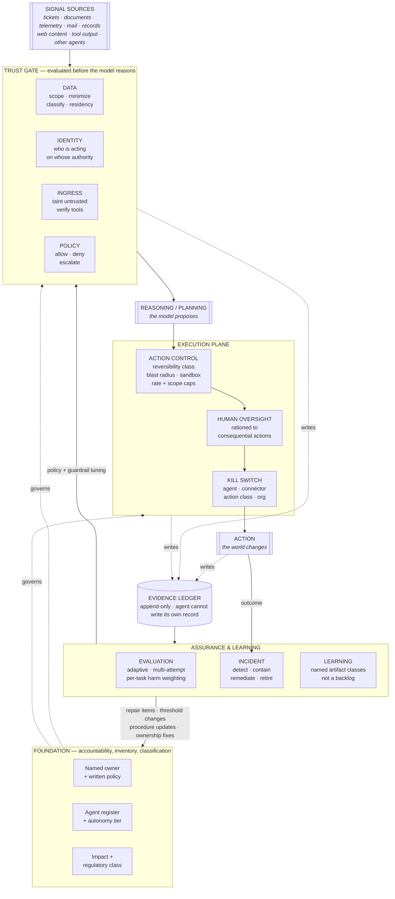

# AGCF — Agentic Governance & Control Framework

**Version 0.9.4 (draft for review) · 29 July 2026**

*v0.9.2 adds two controls generalized from a field implementation — HUM-11 (override is captured, not punished) and OBS-09 (actor-independent ground truth) — amends OBS-02 to require fail-closed attribution, and ships with a companion **Implementation Guide** that collapses the catalogue into a nine-component buildable architecture with a prompt library for executing it in any environment. v0.9.3 rewrites all 106 control statements in Simplified Technical English form (active voice, named doer, second person, one term per concept) and passes the project's own two-stage STE gate at zero findings. v0.9.4 tightens the evidence for IDA-01 and IDA-03 so attribution is demonstrated at the point of action rather than the point of issuance, extends POL-02 to require that every verdict reaches a mechanism that carries it out, and adds ASR-10 (dependent controls are tested as a pair) — all three generalized from a field implementation and recorded in the Implementation Field Notes §13–§14.*

A vendor-neutral reference architecture and self-assessment instrument for governing AI agents, assistants and automation. It scales from an individual practitioner to a regulated enterprise, and it is designed to be used in an afternoon rather than adopted over a year.

---

## 1. What this is, and what it is not

**It is a reference architecture plus a control catalogue.** It says where a control physically sits at runtime — what evaluates a request before the model reasons, what stands between a decision and an action, what writes the record, and what feeds back. Then it lists 107 controls across twelve domains, each tagged with the organization size and the level of agent autonomy at which it becomes mandatory, and each mapped to the standards an auditor or enterprise customer is likely to ask about.

**It is not a management system standard.** ISO/IEC 42001 is that, and it is certifiable; this is not, and does not try to be. **It is not a risk taxonomy.** OWASP's LLM and Agentic Top 10s and MITRE ATLAS are those, and they are better at it than a general framework can be. **It is not a substitute for legal advice** on any of the regimes it cites.

### Why another framework

The published material clusters into two shapes.

**Management systems** — NIST AI RMF 1.0, ISO/IEC 42001:2023 — tell you what organizational functions must exist: govern, map, measure, manage; policy, roles, impact assessment, lifecycle. They are correct and they are documentation-centric. They will not tell you that the policy gate has to sit between the planner and the tool call rather than in the system prompt.

**Risk taxonomies** — OWASP's Top 10 for LLM Applications (2025), the OWASP Top 10 for Agentic Applications (v1.0, December 2025), the ASI threat classes T1–T15, MITRE ATLAS — tell you what goes wrong. They are excellent and they are diagnostic. They will not tell you which twelve things a fourteen-person medical billing company should do first.

The gap between them is an *architecture*: a statement of where controls live and in what order they fire. NIST is filling part of it — the SP 800-53 Control Overlays for Securing AI Systems (COSAiS) programme has planned overlays for single-agent and multi-agent systems — but as of July 2026 those remain at concept-paper and annotated-outline stage. CSA's MAESTRO is the closest published thing, and it is a seven-layer threat-modelling reference rather than a runtime pattern.

This framework occupies that gap, and stays deliberately thin so it can sit *beside* the others rather than competing with them.

### Design commitments

1. **Autonomy, not organization size, is the primary risk axis.** A one-person shop running an agent with write access to a production database is taking on more risk than a thousand-person company running a chatbot that only reads the FAQ. Both axes are used; autonomy dominates.
2. **Containment carries the weight, not approval.** Human-in-the-loop is a real control that degrades under volume. Published containment research reports approval rates around 93% on permission prompts — an approval gate asked too often is a click-through, not a decision. Every control that leans on a human is paired with one that holds when the human clicks Approve.
3. **Every control names its evidence.** A control you cannot evidence is a control you do not have. The catalogue states, for each entry, what you would show someone.
4. **The gap between "implement" and "develop" is preserved.** Some absent controls are procurement and execution. Others have no off-the-shelf answer for your context and require design. Conflating them is how programmes miss dates.
5. **Nothing is claimed to be settled that isn't.** Where the underlying standard is draft, pre-stable, or moving, the framework says so. §9 lists the moving parts explicitly.

---

## 2. The reference architecture

Six stages, four planes. The planes are how the controls are grouped; the stages are how a request actually flows.

### The stages, in order

**Signal sources.** Whatever the agent reads. The critical property is that *every one of them is a potential injection vector*. A ticket description, a PDF, a web page, a log line, an MCP tool description, a message from another agent — all of it is content that an adversary may have authored. Sources are not trusted by default; they are classified.

**Trust Gate.** Four questions, answered before the model reasons, in this order:

| | Question | Domain |
|---|---|---|
| Data | What may this agent see, and has it been minimized, classified and kept in the right jurisdiction? | DAT |
| Identity | Which agent is this, whose authority is it borrowing, and what is that authority scoped to *right now*? | IDA |
| Ingress | Is this content trusted, and are the tools what they claim to be? | ING |
| Policy | Given all of the above, is this permitted — allow, deny, or escalate? | POL |

Positioning the gate *before* reasoning rather than after generation is the single most consequential architectural choice here. Most published reference designs guardrail the output. Output guardrails are necessary and insufficient: by the time you are filtering output, the sensitive data has already been in the context and the poisoned instruction has already been read.

**Reasoning.** The model proposes. The framework has almost nothing to say about this stage, deliberately. Prompt engineering is not a control.

**Execution plane.** What actually happens, bounded by construction. Action reversibility class determines the controls; the human gate is applied selectively rather than universally; the kill switch is layered so you can stop a connector without stopping the company.

**Evidence ledger.** Written continuously by the gate, the execution plane and the action itself — not assembled at audit time. The integrity requirement is what makes it evidence: append-only or tamper-evident, and the agent identity does not hold write access to its own audit path.

**Assurance and learning.** Evaluation before and after launch; incident response when it goes wrong; and a learning loop that terminates in *named artifact classes* — remediation items, threshold changes, procedure updates, ownership corrections — rather than in a resolution to improve. Named classes are countable, and countable is auditable.

### The four planes

| Plane | Domains | What it answers |
|---|---|---|
| **Foundation** | GOV, INV | Who is accountable, and what do we actually have running? |
| **Trust Gate** | DAT, IDA, ING, POL | What may enter, on whose authority, under what policy? |
| **Execution** | ACT, HUM, OBS | What may it do, how far can damage travel, who can stop it, what is recorded? |
| **Assurance & Learning** | ASR, IRR, LRN | How do we know it works, what happens when it doesn't, how does it improve? |

---

## 3. The two axes

### Organization tier

Tiers set the *rigour* expected, not the *scope* of concern. A solo practitioner has the same failure modes as an enterprise; they have fewer people to formalize them.

| Tier | Who | The bar |
|---|---|---|
| **T1 — Individual / Solo** | One person or a handful. No dedicated security or compliance function. | Know what you're running. Don't leak. Don't let it break things you can't undo. |
| **T2 — Small–Mid Organization** | Has IT, may have security. Real customer or employee data. Contractual and sectoral obligations. | Repeatable process, technical enforcement, evidence you can produce on request. |
| **T3 — Enterprise / Regulated** | Formal risk function, audit, regulator or large-customer scrutiny. | Policy as code, independent assurance, evidence that survives adversarial review. |

Tiers are cumulative: T3 inherits everything in T1 and T2.

### Autonomy level

The dominant axis. It maps to how the EU AI Act frames human oversight — "proportionate to the risks, level of autonomy and context of use" (Art. 14(1)) — and to the Annex XIII(e) systemic-risk criterion, which explicitly names autonomy and tool-use capability.

| Level | Name | What it does | The question it forces |
|---|---|---|---|
| **A0** | Advisory | Reads and answers. No systems of record, no actions. | Do we know it exists and what people put into it? |
| **A1** | Assistive | Reads organizational data, produces artifacts a human then uses. Retrieval, summarization, drafting. | What can it see, and where does the output go? |
| **A2** | Gated executor | Proposes actions in real systems; a human approves each consequential one. | Is the approval real, or is it a click-through? |
| **A3** | Bounded autonomous | Executes within a pre-approved envelope without per-action approval. Humans supervise on the loop. | What are the walls of the envelope, and who verified them? |
| **A4** | Open autonomous / multi-agent | Sets its own sub-goals, spawns or directs other agents, or operates in an envelope broad enough that its actions cannot be individually anticipated. | Can we still attribute, contain and reverse? |

Levels are cumulative. Assess against the **highest** level you operate anywhere, not the average — a single A3 agent puts the organization at A3.

**The A2 → A3 transition is the one that matters.** Everything below A2 is bounded by a human touching each consequential action. Above it, containment has to hold on its own. Controls ACT-01, ACT-02, ACT-07, ACT-09 and OBS-03 are the minimum crossing set; if any is absent, the transition has not actually been made — it has been assumed.

---

## 4. The twelve domains

**Foundation**

- **GOV — Governance & Accountability.** Someone owns this. There is a written rule about what AI may and may not be used for, and it is reviewed as the ground shifts. Every downstream control inherits its authority from here.
- **INV — Inventory, Classification & Risk Tiering.** You know every AI system and agent operating on your behalf, what each touches, and how autonomous it is. The highest-leverage control in the framework and the one most often skipped because it is unglamorous.

**Trust Gate**

- **DAT — Data Boundary, Provenance & Sovereignty.** The agent reaches exactly the data it needs; its origin and handling terms are known; it doesn't cross borders or contracts it shouldn't. Most organizations believe they have this because they have a classification policy. Having a policy and enforcing it at retrieval time are different things.
- **IDA — Identity, Authority & Attribution.** Every agent has its own identity, acts under authority traceable to a human, holds only the privileges the current task needs, and can be shut off individually. The most commonly missing layer, and the one that makes every other control unenforceable when absent.
- **ING — Ingress Trust & Content Integrity.** Content the agent reads cannot become instructions it obeys, and the tools it uses are what they claim to be. Normalization and deduplication do not sanitize adversarial content; they launder it into something that looks trusted.
- **POL — Policy Enforcement & Guardrails.** Written policy becomes an evaluated decision at a chokepoint the agent cannot route around. A gate needs inputs, a verdict, an unbypassable enforcement point, and a defined behaviour on deny.

**Execution**

- **ACT — Action Control & Blast Radius.** Harm is bounded by construction: by action class, by how far a mistake propagates, by how fast you can stop it. This is the layer that carries the weight.
- **HUM — Human Oversight & Competence.** The humans in the loop have the competence, the information, the authority — and a small enough volume of decisions that their attention still means something.
- **OBS — Observability & Evidence.** You can reconstruct what an agent did, why, on whose authority, and what resulted — from a record the agent could not have altered.

**Assurance & Learning**

- **ASR — Assurance, Evaluation & Red Teaming.** Evidence the agent behaves acceptably before it goes live and continues to after, including under someone actively trying to make it misbehave.
- **IRR — Incident Response, Recovery & Retirement.** Detect, stop, undo what can be undone, tell who needs telling, and retire cleanly.
- **LRN — Learning & Continuous Improvement.** What the system learns in operation changes the system, as specific owned artifacts rather than as a resolution.

The full catalogue — 107 controls with statements, evidence requirements, tier and autonomy tags, and standards mappings — is Appendix A.

---

## 5. Running an assessment

### Who is in the room

At T1, one person and two hours. At T2: the person accountable for AI use, someone who knows the systems, and someone who knows the obligations — three people, half a day. At T3, run it per business unit or per agent portfolio rather than once for the whole organization; a single enterprise-wide score hides everything interesting.

### The four steps

**1. Set the profile.** Organization tier and highest autonomy level. Be honest about autonomy — the temptation is to score the agent you designed rather than the one that is running.

**2. Score each applicable control.** Five states:

| State | Weight | Means |
|---|---|---|
| **In Place** | 3 / 3 | Implemented, operating, and you could show evidence today. |
| **Partial** | 2 / 3 | Exists but incomplete, inconsistent, or unevidenced. |
| **Develop** | 1 / 3 | Required, absent, and there is no off-the-shelf answer for your context. Design work. |
| **Must Implement** | 0 / 3 | Required at your tier, absent, known solution exists. Execution work. |
| **Not Applicable** | excluded | Genuinely out of scope — *requires a written justification to count.* |

The discipline that makes this worth doing is in the second column of that table: **an unevidenced control is Partial at best.** Teams that score against intent produce a number that flatters them and a report that is useless.

Unassessed controls score zero and stay in the denominator, so an unfinished assessment cannot look better than a completed one with real gaps.

**3. Read the shape, not just the score.** §6.

**4. Produce the gap report.** Ordered by tier urgency, position in the chain, and your context flags — Foundation and Trust Gate gaps rank above Execution ones, because they change what the later controls are able to enforce at all.

### Interpreting the number

Readiness = (3 × in place + 2 × partial + 1 × develop) ÷ (3 × scored controls).

It is a **weighted completion measure, not a risk score.** A high score means the controls you claim are present. It does not mean they work — only the ASR domain tells you that, which is why a high overall readiness with a weak Assurance plane should be read as *unverified*, not as *strong*.

Rough bands, offered as orientation and not as a certification: **below 40%** — you are operating on trust rather than control; stop expanding autonomy until Foundation and Trust Gate are addressed. **40–65%** — a real programme with real holes; the gap report is your roadmap. **65–85%** — mature; the remaining work is usually evidence and assurance rather than controls. **Above 85%** — verify the scoring was honest before celebrating, then push on ASR.

---

## 6. Failure shapes

Patterns that recur, and what each one means. Read the plane profile on the dashboard, not just the total.

**The Fast Mover.** Execution strong, Trust Gate weak. Agents are doing real work with real access, and nothing evaluates a request before the model reasons. The most common shape in organizations that moved quickly and the most dangerous, because capability is already deployed and the controls have to be retrofitted underneath live systems. *Fix order: IDA, then ING, then POL.*

**The Paper Programme.** Foundation strong, everything else weak. Policy, committee, risk register — and no technical enforcement anywhere. Passes a questionnaire, fails an incident. *Fix order: POL-02 (unbypassable enforcement point), then ACT-01/02, then OBS-01/02.*

**The Blind Operator.** Everything moderate, Observability weak. You cannot answer "what did it do?" This is the shape that turns a small incident into an unbounded one, because containment becomes a search problem with no index. *Fix order: OBS-01, OBS-02, IDA-07 — in that order, and before anything else.*

**Approval Theatre.** HUM scored high on the presence of a human gate; HUM-02 and HUM-03 absent. Nobody is measuring approval volume or approval rate, so nobody knows the gate is a click-through. The remedy is counter-intuitive: *remove* approval prompts on low-consequence actions so that attention is available for the ones that matter, and add containment underneath.

**The Unattributed Fleet.** IDA weak while ACT and OBS are strong. Excellent logs of actions that cannot be attributed to a principal. Usually caused by agents running on a shared service account or a human's credentials. Everything downstream — revocation, least privilege, non-repudiation, incident scoping — is compromised by this single root cause. *Fix IDA-01 first; several other scores will improve without further work.*

**The Unverified Estate.** High overall readiness, ASR weak. Controls are claimed present and never tested. The score is describing a design, not a system. *Fix order: ASR-01, ASR-03 — one adaptive red-team pass will re-price the rest of the assessment.*

---

## 7. Adoption sequence

For an organization starting from nothing. Adjust for tier; the *order* holds across all three.

**First (days 1–30) — stop the bleeding, learn what you have.**
GOV-01 named owner · GOV-02 written policy · INV-01/02/03 register with autonomy tiers · DAT-07 provider training and retention terms · ACT-01/02 reversibility classification and gating of irreversible actions · ACT-07 kill switch · IRR-01 AI incidents in scope of the IR process.
*Rationale: these are cheap, they are almost entirely non-technical, and every one of them makes the next phase possible. ACT-02 and ACT-07 are the only two that materially reduce risk on day one, so do them in week one.*

**Second (days 31–90) — make the gate real.**
IDA-01/03/04 agent identity, delegation, per-action scoping · DAT-02/03 default-deny scope and retrieval minimization · ING-01/02/03 untrusted content marking, injection boundary, tool approval · POL-02/03 unbypassable enforcement, fail closed · OBS-01/02 action logging with attribution.
*Rationale: this is the phase that converts policy into enforcement. It is also the phase organizations skip, which is why the Fast Mover shape is so common.*

**Third (days 91–180) — verify, and close the loop.**
ASR-01/02/03 acceptance criteria, task-level evaluation, adaptive multi-attempt testing · HUM-02/03 measure and ration the oversight burden · OBS-03 tamper-evident evidence · IRR-03/04 containment and remediation playbooks · LRN-01/02 route findings to named artifact classes and tune controls.
*Rationale: until this phase, you have a design. After it, you have evidence.*

**Then, and only then:** raise autonomy. ACT-09 is not decoration — autonomy is a graduation against stated criteria, not a launch setting.

---

## 8. Using the crosswalk

Each control maps to NIST AI RMF 1.0 subcategories, ISO/IEC 42001:2023 Annex A controls, EU AI Act articles, and a fourth column for whatever else is most relevant — OWASP threat IDs, MCP specification requirements, US state law, sector rules.

Use it in **both** directions.

*Inward:* if you already run an ISO 27001 ISMS or a SOC 2 programme, a substantial fraction of the Foundation and Execution planes is evidence you already produce. ISO/IEC 42001 shares the Annex SL harmonized structure with 27001, so clauses 4–10 map nearly one-to-one; 42001 deliberately does not duplicate information-security controls, which is why several AGCF controls (IDA-05, ACT-03, ACT-04, OBS-03) map more naturally to 27001 Annex A than to anything in 42001.

*Outward:* the crosswalk shows where an existing programme has no coverage. In practice the consistent blanks are IDA (agent identity), ING (ingress trust and tool integrity), and ACT (blast radius) — the layers that are specific to agents taking actions and that predate no existing control set.

Mappings are **indicative, not equivalence claims.** A control mapped to GOVERN 1.6 is not a certification that satisfying it satisfies GOVERN 1.6. Verify against the source standard before relying on one in an audit.

The crosswalk was independently verified on 28 July 2026 against NIST AI 100-1 Appendix A, the ISO/IEC 42001:2023 Annex A control list, the consolidated AI Act as amended by Regulation (EU) 2026/1744, and OWASP and MCP primary sources. Twenty-nine citations were corrected in that pass — most consequentially, Art. 10(5) had been **deleted** by the Omnibus and relocated to the new Art. 4a, and Art. 15(2) is an obligation on the Commission rather than on providers (the operative paragraph is 15(3)). Both errors would have survived any check against a pre-July-2026 copy of the Act. Treat that as the illustration of §9's point rather than as a footnote.

---

## 9. Currency, and what is moving

The value of a crosswalk decays. As of **28 July 2026**, these are the moving parts. Re-check each before relying on it.

**EU AI Act.** Regulation (EU) 2026/1744 — the "Digital Omnibus on AI" — entered into force **27 July 2026**, one day before this document. It deferred Chapter III high-risk obligations for Annex III stand-alone systems to **2 December 2027** and for Annex I embedded systems to **2 August 2028**. It softened Art. 4 AI literacy to a support-and-provide standard, added Art. 4a, added two Art. 5 prohibitions (non-consensual intimate imagery and CSAM generation, effective 2 December 2026), and gave the AI Office new supervisory powers. **Art. 50 transparency was not deferred and applies from 2 August 2026**, with a grace period to 2 December 2026 for systems already on the market. Several official Commission pages and most third-party trackers still show pre-Omnibus dates; verify against the OJ text.

**NIST AI RMF.** Version 1.0 (January 2023) remains current. NIST states the framework "is being revised," with the declared scope of removing references to misinformation, DEI and climate change per the July 2025 *America's AI Action Plan*. No draft, RFI or timeline has been published. There is no AI RMF 2.0. The Generative AI Profile (NIST AI 600-1, July 2024) is final and unrevised.

**NIST agentic control overlays.** COSAiS — SP 800-53 Control Overlays for Securing AI Systems — has planned overlays for single-agent and multi-agent systems. As of this date only a concept paper (August 2025) and one annotated outline for a different use case (January 2026) exist. CAISI's RFI on AI agent security closed 9 March 2026 with roughly 400 responses; no resulting guideline has published. **This is the largest known gap in the public control base, and it is the reason several AGCF controls in ING, ACT and ASR are likely to score *Develop* rather than *Must Implement*.**

**ISO/IEC.** 42001:2023 is edition 1 with no registered revision. 42005:2025 (impact assessment, May 2025) and 42006:2025 (certification body requirements, July 2025) are published. 27090 — AI security threats and compromises — was at FDIS ballot as of June 2026 and is expected to publish late 2026; it will fill the AI-specific security layer that neither 27002 nor 42001 Annex A currently covers.

**OWASP.** The LLM Top 10 remains the 2025 edition; anything marketed as a "2026 LLM Top 10" is a re-tread. The Agentic Applications Top 10 (ASI01–ASI10) reached v1.0 in December 2025, and the ASI threats-and-mitigations taxonomy runs T1–T15 (some secondary sources assert a T16/T17 that could not be confirmed on any OWASP-controlled source; treat those as unverified). AIVSS remains pre-1.0.

**Agent identity.** No settled standard. The most mature work is `draft-ietf-oauth-identity-assertion-authz-grant` (adopted OAuth WG document, Standards Track). Other agent-identity drafts are individual submissions or expired. SPIFFE/SPIRE remains the de-facto production mechanism for workload identity. Treat vendor "agent identity" product claims with more scepticism than usual — this is the most heavily marketed area in the landscape.

**Observability.** OpenTelemetry GenAI semantic conventions — including agent spans and MCP conventions — are all at **Development** status, not stable. Do not build a compliance evidence schema that assumes their attribute names will hold.

**US policy.** Federal direction is deregulatory and preemption-oriented; the December 2025 executive order created a DOJ task force to challenge state AI laws. Binding pressure has moved to the states: Colorado's ADMTA replaces the 2024 Colorado AI Act effective 1 January 2027 (impact assessments and the risk-management programme duty are gone; transparency, 30-day adverse-outcome disclosure, three-year records and a trained overriding human remain), Texas TRAIGA is effective and offers a **safe harbour tied to NIST AI RMF conformity**, California SB 53 and Illinois SB 315 impose frontier-developer transparency and — in Illinois from 2028 — mandatory third-party audit. OMB M-25-21 and M-25-22 replaced M-24-10 and M-24-18 and drive federal contractor flow-downs.

---

## 10. Extending it

The catalogue ships as `catalog.json` and the assessment tool reads it directly. To adapt:

- **Add a sector overlay** by appending controls with your own ID prefix and the same shape — `id`, `title`, `statement`, `tier`, `autonomy`, `evidence`, `xw`. HIPAA, PCI-DSS, FedRAMP and sector-specific overlays are the obvious extensions.
- **Change the tier boundaries.** The `tier` and `autonomy` fields on each control are the only thing determining applicability. If your smallest business unit should be held to T3 on data controls, retag them.
- **Replace the crosswalk columns.** The `xw` object's keys become the crosswalk table headers. Swap in your own control framework and the tool renders it.
- **Keep the evidence field honest.** It is the field that makes the difference between an assessment and a survey.

The tool stores nothing in the browser and sends nothing anywhere. Assessments save to and load from a local JSON file, which makes them diffable and version-controllable — run the assessment quarterly and commit the result, and the delta is your programme's actual trajectory.

---

## 11. Provenance

This framework generalizes an operational architecture originally developed for incident and service operations in a large regulated healthcare context, where the components were vendor-specific (incident management, telemetry, service ownership, knowledge bases) and the trust controls were sector-specific (PHI detection, de-identification, need-to-know, evidence ledger).

The abstraction preserved from that origin is the sequence — signals, normalization, an evaluated policy gate, distinct intelligence layers, a gated execution plane, and a learning loop that closes to concrete artifacts — and two properties that most published frameworks lack: **evidence captured at runtime rather than assembled at audit time**, and **a learning loop that terminates in named artifact classes rather than in abstract continuous improvement**.

Six things were added because the original, like most operational architectures, assumed a trusted pipeline: an identity layer, an ingress trust boundary, an action reversibility axis, an integrity model for the evidence store, kill switches and decommissioning, and multi-agent boundaries. The human approval gate was demoted from primary control to one of three, on the evidence that it does not hold alone.

---

*AGCF v0.9 is a draft for review. It is offered without warranty and is not legal advice. Standards citations are current as of 28 July 2026 and will decay — see §9.*

---

## Appendix A — Control catalogue

107 controls across 12 domains. **Tier** is the organization tier at which the control becomes mandatory (cumulative: T3 inherits T1 and T2). **Autonomy** is the level at and above which it applies.

### GOV — Governance & Accountability
*Plane: Foundation*

**Purpose.** Someone owns this. There is a written rule about what AI may and may not be used for, people know it, and the rule is reviewed as the ground shifts.

> Every downstream control inherits its authority from here. Without a named owner and a written boundary, the rest of the framework is a wish list.

**GOV-01 · Named accountable owner**  `T1` `A0+`  
One named person owns AI and agent use and has the authority to stop it. A committee does not satisfy this control.  
*Evidence:* Role description, org chart entry, or a line in the AI policy naming the person.  
**NIST AI RMF:** GOVERN 2.1, GOVERN 2.3 · **ISO 42001:** A.3.2 · **EU AI Act:** Art. 26(2)

**GOV-02 · Written AI use policy**  `T1` `A0+`  
You have a written policy that states which AI use you permit, which you prohibit, which needs approval, and who decides.  
*Evidence:* The policy document, with a version and date. Evidence it was distributed.  
**NIST AI RMF:** GOVERN 1.2, GOVERN 1.4 · **ISO 42001:** A.2.2, A.2.3, A.9.2 · **EU AI Act:** Art. 26(1)

**GOV-03 · Risk appetite and prohibited-use list**  `T2` `A0+`  
You have decided, in writing, which categories of AI use you refuse and how much residual risk you accept.  
*Evidence:* Prohibited-use list; documented risk tolerance statement approved at the right level.  
**NIST AI RMF:** GOVERN 1.3, MAP 1.5, MANAGE 1.4 · **ISO 42001:** A.2.2, Annex C · **EU AI Act:** Art. 5 (prohibited practices)

**GOV-04 · AI literacy and role-based training**  `T1` `A0+`  
You train everyone who builds, operates, or approves an AI system, and everyone the system affects. Training matches the role and covers known failure modes.  
*Evidence:* Training materials, completion records, role-to-training mapping.  
**NIST AI RMF:** GOVERN 2.2, MAP 3.4 · **ISO 42001:** A.4.6 · **EU AI Act:** Art. 4 (in force since 2 Feb 2025; amended 27 Jul 2026 to a support-and-provide standard)

**GOV-05 · Executive and board accountability**  `T3` `A1+`  
Leadership formally owns AI risk decisions. Leadership reviews those decisions on a defined cadence with primary data, not a status slide.  
*Evidence:* Meeting minutes, standing agenda item, escalation records.  
**NIST AI RMF:** GOVERN 2.3, GOVERN 1.5 · **ISO 42001:** Clause 5, A.3.2

**GOV-06 · Cross-functional review body**  `T2` `A2+`  
A standing group with legal, security, privacy, and domain members reviews each new agent use case before it goes live.  
*Evidence:* Terms of reference, membership, review records with decisions.  
**NIST AI RMF:** GOVERN 3.1, GOVERN 4.1 · **ISO 42001:** A.3.2, A.5.2 · **EU AI Act:** Art. 27 (FRIA, where applicable)

**GOV-07 · Resourcing**  `T3` `A1+`  
You allocate budget and staff time to AI governance as named line items. Governance work belongs to a person, not to spare time.  
*Evidence:* Budget line, headcount allocation, or documented time allocation.  
**NIST AI RMF:** MANAGE 2.1, GOVERN 2.1 · **ISO 42001:** Clause 7.1, A.4.2

**GOV-08 · Contractual flow-down to suppliers**  `T2` `A1+`  
Your supplier contracts contain the AI governance requirements: data use, training rights, incident notice, model change notice, and evidence access.  
*Evidence:* Contract clauses, vendor questionnaire, procurement standard.  
**NIST AI RMF:** GOVERN 6.1, MAP 4.1 · **ISO 42001:** A.10.2, A.10.3 · **EU AI Act:** Art. 25 (value chain), Art. 53(b) · **Other:** US: OMB M-25-22 flow-downs for federal contractors

**GOV-09 · Regulatory applicability determination**  `T2` `A0+`  
You know which AI laws apply to you, in which jurisdictions, on which dates. You refresh this determination when the law moves.  
*Evidence:* Applicability memo with jurisdictions, obligations and dates; review date.  
**NIST AI RMF:** GOVERN 1.1, MAP 1.1 · **ISO 42001:** Clause 4.1, 4.2, A.2.3 · **EU AI Act:** Art. 2 (scope), Art. 113 (as amended by Reg. (EU) 2026/1744) · **Other:** US state law: CO ADMTA (1 Jan 2027), TX TRAIGA, CA SB 53, IL SB 315

### INV — AI Register, Classification & Risk Tiering
*Plane: Foundation*

**Purpose.** You know every AI system and agent operating on your behalf, what each one touches, how autonomous it is, and how much damage it could do.

> You cannot govern what you cannot enumerate. Inventory is the single highest-leverage control in the framework and the one most often skipped because it is unglamorous.

**INV-01 · Register of AI systems and agents**  `T1` `A0+`  
You maintain an AI register that lists every AI system and agent in use. The register includes AI features embedded inside SaaS products.  
*Evidence:* The register itself, with a last-reviewed date.  
**NIST AI RMF:** GOVERN 1.6 · **ISO 42001:** A.4.2, A.6.2.7 · **EU AI Act:** Art. 49 (registration, where high-risk)

**INV-02 · Register content is sufficient to govern**  `T1` `A0+`  
Each register entry records purpose, business owner, model and provider, reachable data, available tools and actions, and runtime location.  
*Evidence:* Register schema and a populated sample.  
**NIST AI RMF:** MAP 1.1, MAP 2.1 · **ISO 42001:** A.6.2.2, A.6.2.7 · **EU AI Act:** Art. 11 + Annex IV (technical documentation)

**INV-03 · Autonomy tier assigned**  `T1` `A0+`  
You assign each agent an autonomy level, from advisory to open autonomous. The assigned level selects which controls apply.  
*Evidence:* Autonomy tier recorded per entry; tier definitions documented.  
**NIST AI RMF:** GOVERN 1.3, MAP 2.2, MAP 3.5 · **ISO 42001:** A.6.2.2, A.9.4 · **EU AI Act:** Art. 14(1) (oversight proportionate to autonomy); Annex XIII(e)

**INV-04 · Impact and consequence classification**  `T2` `A0+`  
Each use case records who the outputs affect and how badly, including people who are not your users.  
*Evidence:* Impact assessment per use case; affected-population analysis.  
**NIST AI RMF:** MAP 5.1, MAP 3.2 · **ISO 42001:** A.5.2, A.5.3, A.5.4, A.5.5 · **EU AI Act:** Art. 27 (FRIA) · **Other:** ISO/IEC 42005:2025

**INV-05 · Regulatory classification per use case**  `T2` `A1+`  
You classify each use case against the applicable regimes: prohibited, high risk, transparency only, or minimal. You record the reasoning.  
*Evidence:* Classification record with rationale, reviewed by someone competent to review it.  
**NIST AI RMF:** GOVERN 1.1, GOVERN 1.3 · **ISO 42001:** A.5.2, Clause 6.1 · **EU AI Act:** Art. 5, Art. 6, Art. 6(3)–(4), Annex III, Art. 50 · **Other:** CO ADMTA 'consequential decision'

**INV-06 · Shadow AI discovery**  `T2` `A0+`  
You operate an active mechanism that finds AI and agent use which skipped the approval process. A policy alone does not satisfy this control.  
*Evidence:* Discovery method (egress logs, SaaS discovery, expense review, survey) and findings from the last cycle.  
**NIST AI RMF:** GOVERN 1.6, MEASURE 3.1 · **ISO 42001:** A.4.2, A.9.2 · **Other:** OWASP ASI10 (Rogue Agents)

**INV-07 · Reclassification triggers**  `T2` `A2+`  
Defined events force a new review: model version change, new tool or connector, scope expansion, or a new data domain. Old approvals do not carry over.  
*Evidence:* Trigger list; examples of triggered re-reviews.  
**NIST AI RMF:** MANAGE 4.1, MEASURE 2.4 · **ISO 42001:** A.6.2.6, Clause 8.1 · **EU AI Act:** Art. 25 (substantial modification), Art. 43(4)

**INV-08 · Register reconciled to identity and spend**  `T3` `A2+`  
You reconcile the AI register against issued credentials, connector grants, and billing at least monthly. Undeclared agents appear in those three places.  
*Evidence:* Reconciliation report; discrepancies and their resolution.  
**NIST AI RMF:** GOVERN 1.6, MANAGE 3.1 · **ISO 42001:** A.4.2, A.10.3

### DAT — Data Boundary, Provenance & Sovereignty
*Plane: Trust Gate*

**Purpose.** The agent can reach exactly the data it needs, that data's origin and handling terms are known, and it does not cross borders or contracts it shouldn't.

> This is the control most organizations think they have because they have a data classification policy. Having a policy and enforcing it at agent retrieval time are different things.

**DAT-01 · Classification applied to agent-reachable data**  `T1` `A0+`  
You classify every data source an agent can reach. You treat unclassified data as sensitive by default, not as public.  
*Evidence:* Classification scheme; classification applied to the sources in the register.  
**NIST AI RMF:** MEASURE 2.10, GOVERN 1.4 · **ISO 42001:** A.7.2, A.7.4 · **EU AI Act:** Art. 10 (data governance) · **Other:** ISO/IEC 27001 A.5.12

**DAT-02 · Default-deny data scope per agent**  `T2` `A1+`  
Each agent has an explicit allow-list of data domains. Access is default-deny, not everything the service account can see.  
*Evidence:* Per-agent scope configuration; a test showing an out-of-scope source is inaccessible.  
**NIST AI RMF:** MANAGE 1.3, GOVERN 1.4 · **ISO 42001:** A.7.2, A.9.4 · **EU AI Act:** Art. 26(4) · **Other:** OWASP LLM02, LLM08

**DAT-03 · Retrieval-time minimization**  `T2` `A1+`  
The agent receives the least data that completes the task. You filter at retrieval, not in the prompt, and you do not trust the model to filter.  
*Evidence:* Retrieval filter configuration; sample trace showing the data actually passed.  
**NIST AI RMF:** MANAGE 1.3, MEASURE 2.10 · **ISO 42001:** A.7.2, A.7.6 · **EU AI Act:** Art. 10(2) · **Other:** GDPR Art. 5(1)(c)

**DAT-04 · Sensitive-data detection on both directions**  `T2` `A1+`  
Detection for personal, health, payment, credential, and proprietary data runs on content that enters the agent and on content that leaves it.  
*Evidence:* Detector configuration and coverage; recent detection statistics including false-negative testing.  
**NIST AI RMF:** MEASURE 2.7, MEASURE 2.10 · **ISO 42001:** A.7.4, A.6.2.6 · **EU AI Act:** Art. 15 (cybersecurity) · **Other:** OWASP LLM02

**DAT-05 · De-identification and redaction**  `T3` `A1+`  
Where a task does not need identified data, the agent receives de-identified, redacted, or masked data.  
*Evidence:* De-identification method and its validation; documented decision where full fidelity is required.  
**NIST AI RMF:** MANAGE 2.1, MEASURE 2.10 · **ISO 42001:** A.7.6 · **EU AI Act:** Art. 4a (special-category data for bias detection; Art. 10(5) deleted by Reg. (EU) 2026/1744) · **Other:** HIPAA §164.514

**DAT-06 · Residency and sovereignty enforced technically**  `T2` `A1+`  
Configuration and network controls enforce data residency, cross-border transfer limits, and sovereign-compute constraints. A contract clause alone does not satisfy this control.  
*Evidence:* Region pinning configuration; egress controls; transfer mechanism documentation.  
**NIST AI RMF:** GOVERN 1.1, MAP 4.1 · **ISO 42001:** A.4.5, A.10.3 · **EU AI Act:** Art. 2 (extraterritorial scope) · **Other:** GDPR Ch. V; sector sovereignty requirements

**DAT-07 · Provider training and retention terms verified**  `T1` `A0+`  
You know, in writing, whether your prompts and data train each provider model, the retention period, and who can access them. This covers every provider, including AI inside your SaaS tools.  
*Evidence:* Provider terms extract per provider; configuration proving the elected setting.  
**NIST AI RMF:** GOVERN 6.1, MAP 4.1, MANAGE 3.1 · **ISO 42001:** A.10.3, A.7.3 · **EU AI Act:** Art. 25, Art. 53(b) · **Other:** OMB M-25-22 data rights clauses

**DAT-08 · Provenance for corpora and memory**  `T3` `A2+`  
For each item in a corpus, fine-tuning set, or agent memory, you can name its origin, its writer, and its write time.  
*Evidence:* Provenance metadata schema; sample lineage trace.  
**NIST AI RMF:** MAP 4.1, MEASURE 2.8 · **ISO 42001:** A.7.5 · **EU AI Act:** Art. 10(2), Art. 53(d) · **Other:** OWASP ASI06, LLM04

**DAT-09 · Retention and deletion across the whole footprint**  `T2` `A1+`  
Retention and deletion rules cover prompts, outputs, embeddings, agent memory, and execution traces. The rules do not stop at the system of record.  
*Evidence:* Retention schedule naming each store; evidence of deletion executing.  
**NIST AI RMF:** GOVERN 1.7, MANAGE 4.1 · **ISO 42001:** A.7.2, A.6.2.8 · **EU AI Act:** Art. 12, Art. 26(6) (min. 6 months for high-risk deployer logs) · **Other:** GDPR Art. 17

**DAT-10 · Lawful basis for what the agent does**  `T2` `A0+`  
You have an identified lawful basis or consent for the processing the agent performs, including secondary use the agent creates.  
*Evidence:* Records of processing; DPIA where required; consent records.  
**NIST AI RMF:** GOVERN 1.1, MAP 1.1 · **ISO 42001:** A.5.4, Clause 4.2 · **EU AI Act:** Art. 26(9) (DPIA) · **Other:** GDPR Art. 6, Art. 35; HIPAA minimum necessary

### IDA — Identity, Authority & Attribution
*Plane: Trust Gate*

**Purpose.** Every agent has its own identity, acts under authority that traces to a human, holds only the privileges its current task needs, and can be shut off individually.

> The most commonly missing layer, and the one that makes every other control unenforceable when absent. If the agent uses a human's credentials, your logs say a human did it, your revocation kills that human's access, and your least-privilege story is fiction.

**IDA-01 · Distinct identity per agent**  `T2` `A1+`  
Each agent authenticates as itself. An agent never borrows a human credential, a shared service account, or a long-lived admin credential.  
*Evidence:* Identity per agent in the directory or secret store; no shared-credential exceptions outstanding; the agent identity present on an authorization decision record, not only in the directory.  
**NIST AI RMF:** GOVERN 3.2, MANAGE 1.3 · **ISO 42001:** A.3.2, A.9.2 · **EU AI Act:** Art. 12 (traceability) · **Other:** OWASP ASI03, T9; CSA Agentic AI IAM

**IDA-02 · Agent identity lifecycle through the IdP**  `T3` `A2+`  
You create, review, and revoke agent identities through the same identity provider and joiner-mover-leaver process as human identities.  
*Evidence:* Provisioning workflow; evidence of a revocation executing end to end.  
**NIST AI RMF:** GOVERN 2.1, MANAGE 2.4 · **ISO 42001:** A.3.2, A.4.6 · **Other:** OWASP ASI03; SCIM/OIDC provisioning

**IDA-03 · Delegation chain is recorded**  `T2` `A2+`  
For any agent action you can answer: which human authorized it, for what scope, and when that authority started and ended.  
*Evidence:* Delegation records or on-behalf-of claims present in logs; a worked example traced from one action record back to the authorizing human — not forward from a grant.  
**NIST AI RMF:** GOVERN 3.2, MANAGE 4.1 · **ISO 42001:** A.6.2.8, A.10.2 · **EU AI Act:** Art. 12, Art. 26(2) · **Other:** OWASP T8; draft-ietf-oauth-identity-assertion-authz-grant

**IDA-04 · Per-action scoping, not per-system**  `T2` `A2+`  
You grant privileges at action granularity: draft but not send, read but not delete. You never hand over a whole business system.  
*Evidence:* Scope definitions per connector; a test showing a denied action class.  
**NIST AI RMF:** MANAGE 1.3, MAP 3.5 · **ISO 42001:** A.9.2, A.9.4 · **EU AI Act:** Art. 14(4) · **Other:** OWASP LLM06 (Excessive Agency), ASI03

**IDA-05 · Short-lived, just-in-time credentials**  `T3` `A2+`  
Agents hold credentials scoped to one task and one time window. No standing long-lived static credentials exist.  
*Evidence:* Token lifetime configuration; absence of static keys in secret inventory.  
**NIST AI RMF:** MANAGE 1.3, MEASURE 2.7 · **ISO 42001:** A.9.2 · **EU AI Act:** Art. 15 · **Other:** CSA Agentic AI IAM; SPIFFE/SPIRE

**IDA-06 · Audience-bound tokens; no passthrough**  `T3` `A2+`  
Each access token binds to one target resource. This control uses the word token deliberately: the mechanism is OAuth audience binding. A credential presented to one service never travels to another service.  
*Evidence:* Token audience validation enabled; architecture review confirming no passthrough path.  
**NIST AI RMF:** MEASURE 2.7 · **ISO 42001:** A.6.2.5 · **EU AI Act:** Art. 15 · **Other:** MCP authorization spec (RFC 8707 resource indicators; passthrough prohibited)

**IDA-07 · Agent actions distinguishable in logs and SIEM**  `T2` `A2+`  
Agent activity forms a distinct actor class in your security telemetry. You can filter it, alert on it, and separate it from human activity.  
*Evidence:* SIEM query returning agent-only activity; actor-type field populated.  
**NIST AI RMF:** MEASURE 2.4, MANAGE 4.1 · **ISO 42001:** A.6.2.8 · **EU AI Act:** Art. 12 · **Other:** OWASP T8 (Repudiation & Untraceability)

**IDA-08 · Granular revocation path**  `T2` `A2+`  
You can revoke one agent, one credential, or one connector without stopping the rest. You have tested this revocation.  
*Evidence:* Documented revocation procedure; evidence of a test.  
**NIST AI RMF:** MANAGE 2.4 · **ISO 42001:** A.6.2.6 · **EU AI Act:** Art. 14(4)(e)

**IDA-09 · Periodic privilege review for agents**  `T3` `A2+`  
The accountable owner reviews agent entitlements at least quarterly, as with human entitlements, and removes accumulated scope.  
*Evidence:* Review records with removals actually executed.  
**NIST AI RMF:** GOVERN 1.5, MANAGE 3.1 · **ISO 42001:** Clause 9.3, A.9.2

### ING — Ingress Trust & Content Integrity
*Plane: Trust Gate*

**Purpose.** Content the agent reads cannot become instructions the agent obeys, and the tools it uses are what they claim to be.

> Prompt injection and tool poisoning arrive through the normal front door — a ticket description, a web page, a document, an MCP tool description. Normalization and deduplication do not sanitize adversarial content; they launder it into something that looks trusted.

**ING-01 · Untrusted sources identified and marked**  `T2` `A1+`  
You classify every content source as trusted or untrusted. Untrusted content keeps its marking as it moves through the pipeline.  
*Evidence:* Source trust classification; taint or provenance field carried in the context.  
**NIST AI RMF:** MAP 4.1, MEASURE 2.7 · **ISO 42001:** A.7.3, A.7.5 · **EU AI Act:** Art. 15(5) · **Other:** OWASP LLM01; ASI01

**ING-02 · Injection resistance between content and instruction**  `T2` `A1+`  
A technical boundary stops retrieved or tool-returned content from redirecting the agent goal or authority. A line in the system prompt is not a boundary.  
*Evidence:* Architecture description of the boundary; injection test results.  
**NIST AI RMF:** MEASURE 2.7, MANAGE 2.2 · **ISO 42001:** A.6.2.4 · **EU AI Act:** Art. 15(5) · **Other:** OWASP LLM01, ASI01, T6

**ING-03 · Tool, connector and skill approval**  `T2` `A2+`  
You list and approve every tool, plugin, MCP server, connector, and skill an agent can use. Agents cannot add tools at runtime.  
*Evidence:* Approved tool register; a blocked attempt to add an unapproved tool.  
**NIST AI RMF:** GOVERN 6.1, MAP 4.1, MANAGE 3.1 · **ISO 42001:** A.4.4, A.10.3 · **EU AI Act:** Art. 25 · **Other:** OWASP ASI04, LLM03; OWASP Agentic Skills Top 10

**ING-04 · Tool supply-chain integrity**  `T3` `A2+`  
You pin each tool and skill by version or hash and verify its source. You detect when one changes.  
*Evidence:* Pinning configuration; integrity verification step in the deployment path.  
**NIST AI RMF:** MANAGE 3.1, MANAGE 3.2 · **ISO 42001:** A.4.4, A.10.3 · **EU AI Act:** Art. 15 · **Other:** OWASP LLM03, ASI04; SLSA/Sigstore

**ING-05 · Tool descriptions treated as untrusted**  `T3` `A2+`  
You review tool descriptions at approval and again when they change. The model reads these descriptions and the user does not. A changed description cancels the prior approval.  
*Evidence:* Description review record; change-detection mechanism.  
**NIST AI RMF:** MANAGE 3.2, MEASURE 2.7 · **ISO 42001:** A.10.3 · **Other:** MCP spec (annotations untrusted); tool poisoning / rug-pull research; OWASP ASI04

**ING-06 · Memory and corpus write-path integrity**  `T3` `A2+`  
You control and log every write path into agent memory and retrieval corpora. An agent cannot silently store attacker content for later use.  
*Evidence:* Write-path access controls; memory write audit log.  
**NIST AI RMF:** MEASURE 2.7, MANAGE 2.2 · **ISO 42001:** A.7.2, A.7.5 · **EU AI Act:** Art. 15(4) (feedback-loop bias) · **Other:** OWASP T1 Memory Poisoning, ASI06, LLM08

**ING-07 · Output handling before downstream use**  `T2` `A1+`  
You validate, escape, or constrain model output before it executes, renders, or reaches another system. Output never runs as code or as a command.  
*Evidence:* Validation layer; test showing an injection payload in output does not execute downstream.  
**NIST AI RMF:** MEASURE 2.7, MANAGE 2.2 · **ISO 42001:** A.6.2.4 · **EU AI Act:** Art. 15 · **Other:** OWASP LLM05, ASI05

**ING-08 · Inter-agent messages authenticated and untrusted**  `T3` `A3+`  
In multi-agent systems, agents authenticate their messages to each other. A message from another agent counts as untrusted input, not as a trusted instruction.  
*Evidence:* Inter-agent auth mechanism; test showing a spoofed or poisoned message is rejected or contained.  
**NIST AI RMF:** MEASURE 2.7, MAP 3.5 · **ISO 42001:** A.6.2.5 · **Other:** OWASP T12, T13, T14; ASI07; CSA MAESTRO L7

### POL — Policy Enforcement & Guardrails
*Plane: Trust Gate*

**Purpose.** Written policy is turned into an evaluated decision that sits between what the agent wants to do and what it is allowed to do, and cannot be talked out of it.

> Most 'trust and safety' layers are a checklist of controls with no decision function. A gate needs inputs, a verdict, an unbypassable enforcement point, and a defined behaviour on deny.

**POL-01 · Policy expressed in evaluable form**  `T3` `A2+`  
The rules that govern agent behaviour exist in a form a machine can evaluate, not only in prose a person can read.  
*Evidence:* Policy definitions in code or configuration; mapping from the written policy to the encoded rules.  
**NIST AI RMF:** GOVERN 1.4, MANAGE 1.3 · **ISO 42001:** A.2.2, A.9.2 · **EU AI Act:** Art. 9

**POL-02 · Enforcement point cannot be bypassed**  `T2` `A2+`  
A chokepoint between decision and action enforces policy, and the agent cannot route around it. The verdict set is: allow, deny, or escalate. Each verdict reaches a mechanism that carries it out.  
*Evidence:* Architecture showing the enforcement point; test attempting to bypass it; the named mechanism for each verdict, and a test that carries an escalate verdict through to a human decision.  
**NIST AI RMF:** MANAGE 1.3, MEASURE 2.6 · **ISO 42001:** A.6.2.5, A.9.2 · **EU AI Act:** Art. 14(4) · **Other:** OWASP LLM06, ASI02

**POL-03 · Deny is safe and defined**  `T2` `A2+`  
On deny, the system fails closed with defined behaviour. It does not proceed silently, retry with new phrasing, or degrade to an unmonitored path.  
*Evidence:* Deny-path specification; log of denials showing what happened next.  
**NIST AI RMF:** MEASURE 2.6, MANAGE 2.2 · **ISO 42001:** A.6.2.5 · **EU AI Act:** Art. 15(4) (fail-safe)

**POL-04 · Ambiguity escalates rather than allows**  `T2` `A2+`  
On an uncertain policy decision, the gate escalates: it holds the action and pages a human. Uncertainty never defaults to permission.  
*Evidence:* Escalation rule; escalation volume and resolution records.  
**NIST AI RMF:** MANAGE 1.3, MAP 3.5 · **ISO 42001:** A.3.3, A.9.2 · **EU AI Act:** Art. 14

**POL-05 · Prohibited uses enforced technically**  `T2` `A1+`  
Technical controls enforce the prohibited-use list from GOV-03. A policy that people read once is not enforcement.  
*Evidence:* Technical control mapped to each prohibited use; test evidence.  
**NIST AI RMF:** GOVERN 1.2, MANAGE 1.3 · **ISO 42001:** A.2.2, A.9.3 · **EU AI Act:** Art. 5

**POL-06 · Output guardrails proportionate to context**  `T1` `A1+`  
You calibrate output guardrails to the audience and the stakes of each use case. One global setting does not fit all uses.  
*Evidence:* Guardrail configuration per use case; rationale for the calibration.  
**NIST AI RMF:** MEASURE 2.6, MANAGE 2.2 · **ISO 42001:** A.6.2.4, A.9.4 · **EU AI Act:** Art. 9(2) · **Other:** OWASP LLM09

**POL-07 · Policy versioning bound to decisions**  `T3` `A2+`  
Every recorded decision names the policy version that governed it. You judge an old action by the rule in force at the time.  
*Evidence:* Policy version identifier present in decision records.  
**NIST AI RMF:** GOVERN 1.4, MANAGE 4.1 · **ISO 42001:** A.2.4, A.6.2.8 · **EU AI Act:** Art. 12

**POL-08 · Exceptions are time-bound and owned**  `T2` `A1+`  
Each policy exception has a named owner, a written justification, an expiry date, and a review. A permanent exception is a policy change.  
*Evidence:* Exception register with expiry dates; evidence of expired exceptions closing.  
**NIST AI RMF:** GOVERN 1.4, MANAGE 1.4 · **ISO 42001:** A.2.4, Clause 6.1

### ACT — Action Control & Blast Radius
*Plane: Execution*

**Purpose.** The agent's ability to cause harm is bounded by construction — by what class of action it may take, how far a mistake can propagate, and how fast you can stop it.

> This is the layer that has to carry the weight, because the human approval gate empirically does not. Published containment data shows approval rates around 93% and injection success rising sharply under repeated adaptive attempts. Containment must hold when the human clicks Approve.

**ACT-01 · Actions classified by reversibility**  `T1` `A2+`  
You classify every available action as read-only, reversible write, irreversible, or destructive. This class, not the tool name, selects the controls.  
*Evidence:* Action inventory with reversibility class per action.  
**NIST AI RMF:** MAP 2.1, MANAGE 1.2 · **ISO 42001:** A.6.2.2, A.9.4 · **EU AI Act:** Art. 9(2) · **Other:** OWASP LLM06

**ACT-02 · Irreversible actions gated or prohibited**  `T1` `A2+`  
Irreversible and destructive actions need explicit human approval, or you remove them from agent reach. Such actions never sit inside the autonomous envelope.  
*Evidence:* Configuration showing the gate or the removal; test attempting the action.  
**NIST AI RMF:** MANAGE 1.3, MAP 3.5 · **ISO 42001:** A.9.2, A.9.4 · **EU AI Act:** Art. 14(4)(d) · **Other:** OWASP ASI10

**ACT-03 · Isolated execution environment**  `T2` `A2+`  
Agents execute code and use tools inside an isolated environment. The isolation boundary separates them from business systems and from the operator host.  
*Evidence:* Sandbox or container configuration; isolation boundary description.  
**NIST AI RMF:** MEASURE 2.7, MANAGE 1.3 · **ISO 42001:** A.4.5, A.6.2.5 · **EU AI Act:** Art. 15(5) · **Other:** OWASP ASI05, T11

**ACT-04 · Controlled network egress**  `T3` `A2+`  
Agent runtimes have default-deny outbound network access with an explicit allow-list. Egress control limits, but does not remove, exfiltration through approved destinations.  
*Evidence:* Egress policy; allow-list with justification per destination.  
**NIST AI RMF:** MEASURE 2.7 · **ISO 42001:** A.4.5 · **EU AI Act:** Art. 15(5) · **Other:** OWASP LLM02

**ACT-05 · Rate, volume and spend limits with automatic cutoff**  `T2` `A2+`  
Hard limits on invocations, model usage, tool calls, and spend stop the agent automatically. An alert that someone reads later is not a limit.  
*Evidence:* Limit configuration; evidence of a cutoff firing.  
**NIST AI RMF:** MANAGE 1.3, MEASURE 2.6 · **ISO 42001:** A.4.5, A.6.2.6 · **EU AI Act:** Art. 15 · **Other:** OWASP LLM10, T4

**ACT-06 · Scope caps per run**  `T2` `A2+`  
Per-run caps bound how much one execution can touch: records changed, messages sent, files changed, recipients addressed. A wrong decision stays small.  
*Evidence:* Cap configuration per agent; a run halted by a cap.  
**NIST AI RMF:** MANAGE 1.3, MANAGE 1.2 · **ISO 42001:** A.9.4 · **EU AI Act:** Art. 9(5) · **Other:** CSA Agentic AI Red Teaming (blast-radius minimization)

**ACT-07 · Layered kill switch**  `T2` `A2+`  
You can stop one agent, one connector, one class of write action, or every agent at once. You have tested each layer.  
*Evidence:* Kill switch at each layer; test records with time-to-stop measured.  
**NIST AI RMF:** MANAGE 2.4, MANAGE 4.1 · **ISO 42001:** A.6.2.6 · **EU AI Act:** Art. 14(4)(e) (stop button)

**ACT-08 · Rollback or compensating action**  `T3` `A2+`  
For each reversible write, a defined procedure undoes it, and someone has run that procedure.  
*Evidence:* Rollback procedure per action class; test evidence.  
**NIST AI RMF:** MANAGE 2.3, MANAGE 4.1 · **ISO 42001:** A.6.2.6 · **EU AI Act:** Art. 15(4)

**ACT-09 · Autonomy earned incrementally**  `T2` `A2+`  
Agents start gated and earn broader autonomy against pre-stated criteria and performance evidence. Autonomy is a graduation, not a launch setting.  
*Evidence:* Promotion criteria; promotion decisions with the supporting evidence.  
**NIST AI RMF:** MEASURE 2.6, MANAGE 1.3 · **ISO 42001:** A.6.2.4, A.6.2.5 · **EU AI Act:** Art. 9(6)–(8)

**ACT-10 · Multi-agent orchestration bounded**  `T3` `A3+`  
Where agents invoke agents, limits bound delegation depth, fan-out, and inherited authority. A sub-agent never gains privileges its caller lacked.  
*Evidence:* Orchestration limits in configuration; authority inheritance rules; test of a privilege-escalation attempt via delegation.  
**NIST AI RMF:** MAP 3.5, MANAGE 1.3 · **ISO 42001:** A.6.2.5, A.9.4 · **EU AI Act:** Art. 14(1) · **Other:** OWASP T3, T13, ASI07; CSA MAESTRO

### HUM — Human Oversight & Competence
*Plane: Execution*

**Purpose.** The humans in the loop can actually exercise judgment — they have the competence, the information, the authority, and crucially a small enough volume of decisions that their attention still means something.

> Human oversight is a real control that degrades badly when overused. Approving hundreds of low-consequence prompts trains people to approve the one that matters. Oversight must be rationed to be worth anything.

**HUM-01 · Named, competent, empowered overseers**  `T1` `A2+`  
Named, competent people oversee each agent. They understand its limits and hold the authority to override or stop it without asking permission.  
*Evidence:* Assignment records; competence basis; documented authority to stop.  
**NIST AI RMF:** GOVERN 3.2, MAP 3.4, MAP 3.5 · **ISO 42001:** A.4.6, A.9.2 · **EU AI Act:** Art. 14(1)–(4), Art. 26(2)

**HUM-02 · Oversight burden is measured**  `T2` `A2+`  
You track how many approvals people receive and the share they approve. A very high approval rate signals a control failure, not health.  
*Evidence:* Approval volume and approval-rate metrics over time, reviewed by the accountable owner.  
**NIST AI RMF:** MEASURE 1.2, MAP 3.5, MEASURE 4.1 · **ISO 42001:** Clause 9.1, A.6.2.6 · **EU AI Act:** Art. 14(4)(b) (automation bias) · **Other:** OWASP T10 Overwhelming Human in the Loop

**HUM-03 · Approvals rationed to consequential actions**  `T2` `A2+`  
You require human approval only where it changes the outcome. You remove or automate routine low-consequence confirmations to protect attention for decisions that matter.  
*Evidence:* Mapping of which action classes require approval and why; evidence of prompts removed.  
**NIST AI RMF:** MAP 3.5, MANAGE 1.2 · **ISO 42001:** A.9.2 · **EU AI Act:** Art. 14(3) · **Other:** OWASP T10

**HUM-04 · Approvers get enough to decide**  `T2` `A2+`  
An approval request shows what will happen, to what, why the agent proposes it, and where the agent is uncertain. A bare action name with yes and no is not enough.  
*Evidence:* Screenshot or specification of the approval interface.  
**NIST AI RMF:** MEASURE 2.9, MAP 3.5 · **ISO 42001:** A.8.2 · **EU AI Act:** Art. 13, Art. 14(4)(c) · **Other:** OWASP ASI09

**HUM-05 · Automation-bias countermeasures**  `T3` `A2+`  
Active measures counter over-trust. Approvers state a reason for consequential approvals, you sample approved actions for later review, and approvers see the agent error record.  
*Evidence:* The measure in operation; sampling results.  
**NIST AI RMF:** MAP 3.4, MEASURE 2.9 · **ISO 42001:** A.4.6, A.9.2 · **EU AI Act:** Art. 14(4)(b) · **Other:** OWASP T15, ASI09

**HUM-06 · Affected people are informed**  `T2` `A1+`  
When an agent makes or materially shapes a decision about a person, you tell that person an AI system took part.  
*Evidence:* Notice text and where it appears in the journey.  
**NIST AI RMF:** GOVERN 5.1, MEASURE 2.9 · **ISO 42001:** A.8.2, A.8.5 · **EU AI Act:** Art. 26(11), Art. 86 · **Other:** CO ADMTA pre-use notice; GDPR Art. 13–14, 22

**HUM-07 · Appeal and human review route**  `T2` `A1+`  
A working route lets a person contest an agent-driven outcome and get human review inside a stated timeframe.  
*Evidence:* Documented appeal process; volume and outcome statistics.  
**NIST AI RMF:** MEASURE 3.3, MANAGE 4.1, GOVERN 5.2 · **ISO 42001:** A.8.3, A.8.5 · **EU AI Act:** Art. 85, Art. 86 · **Other:** CO ADMTA adverse-decision notice (30 days); GDPR Art. 22(3)

**HUM-08 · Disclosure of AI interaction**  `T1` `A1+`  
When a person interacts with an AI system and it would not otherwise be obvious, you tell them.  
*Evidence:* The disclosure as it appears to the user.  
**NIST AI RMF:** MEASURE 2.8, GOVERN 5.1 · **ISO 42001:** A.8.2 · **EU AI Act:** Art. 50(1) — applies 2 Aug 2026 · **Other:** US state companion-chatbot laws

**HUM-09 · Synthetic content marked**  `T2` `A1+`  
You mark AI-generated or AI-modified content in a machine-readable way and, where the law requires, disclose it to the audience.  
*Evidence:* Marking implementation; sample output with the marking present.  
**NIST AI RMF:** MEASURE 2.8, GOVERN 4.2 · **ISO 42001:** A.8.2 · **EU AI Act:** Art. 50(2), 50(4) — applies 2 Aug 2026; existing systems to 2 Dec 2026 · **Other:** C2PA; EU Code of Practice on Transparency of AI-Generated Content (10 Jun 2026)

**HUM-10 · Workforce consultation**  `T3` `A1+`  
Where agents change how people work, how you evaluate them, or how you allocate tasks, you inform workers and their representatives before deployment.  
*Evidence:* Consultation records; notification to worker representatives.  
**NIST AI RMF:** GOVERN 5.1, MAP 1.6 · **ISO 42001:** A.5.4, A.8.5 · **EU AI Act:** Art. 26(7) · **Other:** National works-council law

**HUM-11 · Override is captured, not punished**  `T2` `A2+`  
You never silently block the ungoverned path: overrides stay possible, always page a human, and convert to a retroactive approval record. You track override rate as system health, never as individual performance. A punished declared override becomes a hidden override.  
*Evidence:* Break-glass procedure; one paged override converted to a retroactive record; override-rate metric reviewed by the accountable owner.  
**NIST AI RMF:** MANAGE 4.1, GOVERN 4.1 · **ISO 42001:** A.3.3, A.6.2.6 · **EU AI Act:** Art. 14(4)(d) · **Other:** OWASP T10, T15

### OBS — Observability & Evidence
*Plane: Execution*

**Purpose.** You can reconstruct what an agent did, why, on whose authority, and what happened as a result — from a record the agent could not have altered.

> This is where your original model is strongest: evidence captured at runtime rather than assembled at audit time. The gap to close is integrity — if the actor can write its own record, it is a log, not evidence.

**OBS-01 · Complete action logging**  `T2` `A2+`  
The evidence record captures every tool invocation with the tool, the arguments, the result, and the timestamp. It shows what the agent did, not only that it ran.  
*Evidence:* Log sample showing a full tool invocation record.  
**NIST AI RMF:** MEASURE 2.4, MANAGE 4.1 · **ISO 42001:** A.6.2.8 · **EU AI Act:** Art. 12(1)–(2) · **Other:** OWASP T8; OpenTelemetry GenAI conventions (Development status)

**OBS-02 · Attribution is complete**  `T2` `A2+`  
Each entry carries agent identity, the human principal, the session, the policy decision, and the granted scopes. Attribution fails closed: you quarantine unmatched actions for human adjudication and never auto-assign an actor.  
*Evidence:* Log schema; a record with all fields populated; the quarantine path for unattributable actions and one adjudicated example.  
**NIST AI RMF:** MANAGE 4.1, GOVERN 3.2 · **ISO 42001:** A.6.2.8, A.10.2 · **EU AI Act:** Art. 12, Art. 26(6) · **Other:** OWASP T8; CSA Agentic AI IAM

**OBS-03 · Tamper-evident evidence store**  `T3` `A2+`  
The evidence record is append-only or tamper-evident. The agent identity holds no write access to its own evidence path.  
*Evidence:* Store configuration; access control showing the agent identity lacks write access to the audit path.  
**NIST AI RMF:** MEASURE 2.7, MANAGE 4.1 · **ISO 42001:** A.6.2.8 · **EU AI Act:** Art. 12, Art. 15(5) · **Other:** OWASP T8 Repudiation & Untraceability

**OBS-04 · Retention meets the longest obligation**  `T2` `A1+`  
You set evidence retention to the longest applicable legal, contractual, or investigative requirement, and you can defend the number.  
*Evidence:* Retention configuration and the obligation it maps to.  
**NIST AI RMF:** GOVERN 1.1, MANAGE 4.1 · **ISO 42001:** A.6.2.8 · **EU AI Act:** Art. 26(6) — at least 6 months for high-risk deployer logs · **Other:** IL SB 315 / CA SB 53 incident records; CO ADMTA 3-year records

**OBS-05 · End-to-end traceability**  `T3` `A2+`  
One trace links the triggering signal, the retrieved context, the model decision, the policy verdict, the approval, the action, and the outcome.  
*Evidence:* A worked trace for a real incident or transaction.  
**NIST AI RMF:** MEASURE 2.4, MANAGE 4.1 · **ISO 42001:** A.6.2.8, A.6.2.6 · **EU AI Act:** Art. 12(2) · **Other:** OpenTelemetry GenAI agent spans

**OBS-06 · Behavioural anomaly detection**  `T3` `A2+`  
You monitor agent behaviour for deviation: unusual volume, novel tool sequences, off-hours activity, and access to new data domains.  
*Evidence:* Detection rules; alerts generated and triaged.  
**NIST AI RMF:** MEASURE 2.4, MEASURE 3.1, MANAGE 4.1 · **ISO 42001:** A.6.2.6 · **EU AI Act:** Art. 26(5), Art. 72 · **Other:** MITRE ATLAS agentic techniques (AML.T0080, T0086, T0101)

**OBS-07 · Cost and consumption telemetry**  `T2` `A1+`  
You monitor consumption per agent, so runaway loops and unexpected spend surface early. A cost anomaly can be the first visible symptom of a behavioural one.  
*Evidence:* Per-agent cost dashboard; alert thresholds.  
**NIST AI RMF:** MEASURE 2.4 · **ISO 42001:** A.4.5 · **Other:** OWASP LLM10 Unbounded Consumption

**OBS-08 · Evidence is exportable and legible**  `T3` `A1+`  
You can export evidence in a form a regulator, auditor, or customer can use, inside a timeframe you have committed to.  
*Evidence:* Export capability; a sample evidence pack.  
**NIST AI RMF:** GOVERN 4.2, MANAGE 4.1 · **ISO 42001:** A.8.3, Clause 9.2 · **EU AI Act:** Art. 12, Art. 21 (cooperation), Art. 26(12) · **Other:** ISO/IEC 42006:2025 (what auditors will ask for)

**OBS-09 · Actor-independent ground truth**  `T3` `A3+`  
At least one telemetry channel records agent effects with zero cooperation from the agent runtime: infrastructure events, database audit logs, or egress logs. You reconcile this channel against the evidence record at least weekly and treat unexplained deltas as findings.  
*Evidence:* Sensor configuration; a reconciliation report including at least one investigated delta.  
**NIST AI RMF:** MEASURE 2.4, MEASURE 2.7, MANAGE 4.1 · **ISO 42001:** A.6.2.6, A.6.2.8 · **EU AI Act:** Art. 26(5), Art. 72 · **Other:** OWASP T8; NIST AI 800-4 (monitoring challenges)

### ASR — Assurance, Evaluation & Red Teaming
*Plane: Assurance & Learning*

**Purpose.** You have evidence the agent behaves acceptably before it goes live and continues to after — including under someone actively trying to make it misbehave.

> Static, single-attempt testing systematically understates agentic risk. Published evaluation work shows injection success rising from roughly 11% under baseline testing to over 80% under adaptive, multi-attempt attack. If you test once and politely, you will not find what an attacker will.

**ASR-01 · Acceptance criteria defined before launch**  `T1` `A1+`  
You write down what good enough means before the agent goes live, in terms someone could dispute.  
*Evidence:* Acceptance criteria document dated before go-live.  
**NIST AI RMF:** MEASURE 1.1, MEASURE 2.3, MAP 2.3 · **ISO 42001:** A.6.2.2, A.6.2.4 · **EU AI Act:** Art. 9(6)–(8), Art. 15(3)

**ASR-02 · Task-level evaluation with harm weighting**  `T2` `A2+`  
Evaluation reports per-task outcomes weighted by consequence, not one aggregate pass rate. A deletion failure and a clumsy email are different findings.  
*Evidence:* Evaluation report showing per-task results and harm weighting.  
**NIST AI RMF:** MEASURE 1.1, MEASURE 2.3, MEASURE 4.2 · **ISO 42001:** A.6.2.4 · **EU AI Act:** Art. 9(5)–(6), Art. 15(3) · **Other:** NIST agent-hijacking evaluation guidance

**ASR-03 · Adaptive, multi-attempt adversarial testing**  `T2` `A2+`  
Injection and manipulation testing is adaptive and repeated. You report success over N attempts, never a single shot.  
*Evidence:* Test methodology and results showing attempt counts.  
**NIST AI RMF:** MEASURE 2.7, MEASURE 3.1, MANAGE 2.2 · **ISO 42001:** A.6.2.4 · **EU AI Act:** Art. 15(5), Art. 55(1)(a) · **Other:** NIST agent-hijacking evaluations; OWASP AI Testing Guide

**ASR-04 · Red team covers the agentic surface**  `T3` `A3+`  
Red teaming covers tool misuse, privilege escalation, memory and context poisoning, and goal manipulation. Where relevant, it covers inter-agent and rogue-agent scenarios.  
*Evidence:* Red team scope mapped to a recognized threat taxonomy; findings and remediation.  
**NIST AI RMF:** MEASURE 2.7, MANAGE 2.2 · **ISO 42001:** A.6.2.4 · **EU AI Act:** Art. 55(1)(a) · **Other:** OWASP ASI Top 10 (ASI01–ASI10) / threat classes T1–T15; MITRE ATLAS; CSA Agentic AI Red Teaming Guide

**ASR-05 · Fairness and disparate-impact evaluation**  `T2` `A1+`  
Where outputs affect access to opportunity, money, care, or liberty, you measure performance across affected groups, not only in aggregate.  
*Evidence:* Disaggregated performance results; the groups tested and why.  
**NIST AI RMF:** MEASURE 2.11, MAP 1.2, MEASURE 4.2 · **ISO 42001:** A.5.4, A.7.4 · **EU AI Act:** Art. 10(2)(f)–(g), Art. 4a, Art. 15(4) · **Other:** US: Title VII, ECOA, FHA; CO ADMTA

**ASR-06 · Model and provider change management**  `T2` `A1+`  
A model version change, a provider default change, or a system prompt change triggers re-evaluation before production. A silent upstream upgrade is a change to your AI system.  
*Evidence:* Change process; a re-evaluation record triggered by an upstream change.  
**NIST AI RMF:** MANAGE 3.2, MEASURE 2.4 · **ISO 42001:** A.6.2.6, A.10.3 · **EU AI Act:** Art. 25, Art. 43(4), Art. 53(b) · **Other:** OWASP LLM03

**ASR-07 · Model and tool supply-chain assurance**  `T2` `A1+`  
For each model, tool, and dataset you use, you know its origin, licence, security posture, and change terms.  
*Evidence:* Supply chain record; provider attestations or assessments.  
**NIST AI RMF:** GOVERN 6.1, GOVERN 6.2, MAP 4.1, MANAGE 3.1 · **ISO 42001:** A.10.3, A.7.3 · **EU AI Act:** Art. 25, Art. 53(b) · **Other:** OWASP LLM03, ASI04

**ASR-08 · Independent review proportionate to impact**  `T3` `A2+`  
Someone who did not build a high-consequence system reviews it: internal audit, an independent team, or a third party.  
*Evidence:* Review report with the reviewer's independence stated.  
**NIST AI RMF:** MEASURE 1.3, GOVERN 4.1 · **ISO 42001:** Clause 9.2, A.6.2.4 · **EU AI Act:** Art. 43 (conformity assessment) · **Other:** ISO/IEC 42006:2025; IL SB 315 third-party audit (from 2028)

**ASR-09 · Post-launch drift monitoring**  `T2` `A2+`  
You measure live performance against the acceptance criteria on a schedule. Degradation triggers action, not a note.  
*Evidence:* Monitoring dashboard against acceptance thresholds; an example of a triggered response.  
**NIST AI RMF:** MEASURE 2.4, MEASURE 3.1, MANAGE 4.1 · **ISO 42001:** A.6.2.6, Clause 9.1 · **EU AI Act:** Art. 72 (post-market monitoring), Art. 26(5) · **Other:** NIST AI 800-4 (monitoring challenges)

**ASR-10 · Dependent controls are tested as a pair**  `T2` `A2+`  
You test controls that depend on each other together, not only one at a time. When one control must invoke another, you name the invocation path and you test it.  
*Evidence:* For each dependency, the named invocation path and a test that exercises it end to end; a list of controls that nothing else can reach.  
**NIST AI RMF:** MEASURE 2.6, MANAGE 1.3 · **ISO 42001:** A.6.2.6, Clause 9.1 · **EU AI Act:** Art. 15(1), Art. 17 · **Other:** OWASP ASI02

### IRR — Incident Response, Recovery & Retirement
*Plane: Assurance & Learning*

**Purpose.** When an agent does something wrong, you detect it, stop it, undo what can be undone, tell who needs telling, and — when the time comes — retire it cleanly.

> Agent incidents have a property normal incidents don't: the system may have taken hundreds of small correct-looking actions before the wrong one, so containment and remediation are a search problem, not just a shutdown.

**IRR-01 · AI incidents are in scope of the IR process**  `T1` `A1+`  
Your incident definition covers agent misbehaviour: wrong actions, harmful output, data exposure, and manipulation. The existing incident response process owns these categories.  
*Evidence:* IR policy naming AI incident categories.  
**NIST AI RMF:** GOVERN 4.3, MANAGE 4.3 · **ISO 42001:** A.8.4 · **EU AI Act:** Art. 3(49) (serious incident), Art. 73 · **Other:** OWASP GenAI Incident Response Guide 1.0

**IRR-02 · Detection and triage path**  `T2` `A2+`  
A defined path notices and triages agent misbehaviour, with signals from monitoring, from users, and from the people the agent acts upon.  
*Evidence:* Detection sources; triage criteria; reporting channel.  
**NIST AI RMF:** GOVERN 4.3, MEASURE 3.1, MEASURE 3.3 · **ISO 42001:** A.3.3, A.8.4 · **EU AI Act:** Art. 26(5), Art. 73

**IRR-03 · Containment playbook**  `T2` `A2+`  
A written playbook covers isolating the agent, revoking its credentials, stopping at the right layer, and preserving evidence before it rotates out.  
*Evidence:* The playbook; evidence it has been exercised.  
**NIST AI RMF:** MANAGE 2.3, MANAGE 2.4, MANAGE 4.3 · **ISO 42001:** A.8.4, A.6.2.6 · **EU AI Act:** Art. 26(5) (suspend use) · **Other:** NIST SP 800-61 process, AI-specific evidence steps

**IRR-04 · Remediation of actions already taken**  `T2` `A2+`  
You can list everything the agent did in the affected window and reverse or compensate for what needs it.  
*Evidence:* Method for enumerating actions in a time window; a worked remediation.  
**NIST AI RMF:** MANAGE 2.3, MANAGE 4.3 · **ISO 42001:** A.6.2.6, A.6.2.8 · **EU AI Act:** Art. 20 (corrective actions)

**IRR-05 · Notification obligations mapped in advance**  `T2` `A1+`  
You map who you must tell, and in what timeframe, before the incident: regulator, customer, data subject, insurer, and model provider.  
*Evidence:* Notification matrix with timeframes and named contacts.  
**NIST AI RMF:** MANAGE 4.3, GOVERN 4.3 · **ISO 42001:** A.8.3, A.8.4 · **EU AI Act:** Art. 73 (serious incident reporting), Art. 55(1)(c) · **Other:** CA SB 53: Cal OES 15 days / 24h imminent; IL SB 315: 72h / 24h; GDPR Art. 33: 72h

**IRR-06 · Blameless post-incident review**  `T2` `A1+`  
A structured review follows each incident and produces a root cause with named follow-up owners. The review never punishes reporting.  
*Evidence:* Post-incident reports with assigned actions and their closure.  
**NIST AI RMF:** MANAGE 4.3, GOVERN 4.3 · **ISO 42001:** A.8.4, Clause 10.2 · **EU AI Act:** Art. 73

**IRR-07 · Clean retirement**  `T2` `A1+`  
Agent retirement follows a defined process: revoke credentials, remove connectors, dispose of memory and derived data per policy, check dependencies, retain evidence.  
*Evidence:* Decommissioning checklist; a completed retirement record.  
**NIST AI RMF:** GOVERN 1.7, MANAGE 2.4, MANAGE 4.1 · **ISO 42001:** A.6.2.6 · **Other:** ISO/IEC 5338:2023 retirement process

**IRR-08 · Continuity without the agent**  `T3` `A2+`  
If you, an incident, or a provider outage stops the agent, a defined fallback covers its work. You have made the dependence explicit.  
*Evidence:* Fallback procedure; the dependency documented in BCP.  
**NIST AI RMF:** GOVERN 6.2, MANAGE 2.3 · **ISO 42001:** A.10.2, A.4.2 · **EU AI Act:** Art. 15(4) (fail-safe)

### LRN — Learning & Continuous Improvement
*Plane: Assurance & Learning*

**Purpose.** What the system learns in operation changes the system — as specific, owned, tracked artifacts rather than as a resolution to do better.

> This is the other place your original model is stronger than the published frameworks: it closes the loop to named artifact classes. 'Continuous improvement' is unauditable. 'Seventeen repair items, four monitor tuning changes, two ownership corrections' is auditable.

**LRN-01 · Findings route to named artifact classes**  `T2` `A1+`  
You route operational findings into named, tracked artifact types: remediation items, threshold changes, procedure updates, and ownership corrections. An undifferentiated backlog does not satisfy this control.  
*Evidence:* The artifact classes; a report of items by class with closure rates.  
**NIST AI RMF:** MANAGE 4.1, MANAGE 4.2 · **ISO 42001:** Clause 10.2, A.6.2.6 · **EU AI Act:** Art. 72 (post-market monitoring plan)

**LRN-02 · Control tuning from operational evidence**  `T2` `A2+`  
You update guardrail thresholds, policy rules, and detection logic from operational evidence, and you version each change.  
*Evidence:* Change log for guardrails and policies with the triggering evidence.  
**NIST AI RMF:** MANAGE 2.2, MEASURE 3.1, MANAGE 4.1 · **ISO 42001:** A.2.4, A.6.2.6 · **EU AI Act:** Art. 9(2)(c)–(d)

**LRN-03 · Knowledge artifacts stay current**  `T2` `A1+`  
You version the prompts, procedures, runbooks, and reference material that agents and operators rely on, and update them when found wrong.  
*Evidence:* Version history showing updates driven by findings.  
**NIST AI RMF:** MANAGE 4.1, GOVERN 4.2 · **ISO 42001:** A.6.2.3, A.6.2.7, Clause 7.5 · **EU AI Act:** Art. 11 (documentation kept up to date)

**LRN-04 · Ownership corrections feed back to the register**  `T2` `A1+`  
When an incident reveals missing or wrong ownership, you correct the AI register and track the correction to closure.  
*Evidence:* Inventory change log tied to findings.  
**NIST AI RMF:** GOVERN 2.1, GOVERN 1.6, MANAGE 4.1 · **ISO 42001:** A.3.2, A.4.2

**LRN-05 · Metrics reviewed on a cadence**  `T2` `A1+`  
The accountable owner reviews a defined set of governance metrics on a stated cadence and records the decisions.  
*Evidence:* Metric set; review records with decisions.  
**NIST AI RMF:** GOVERN 1.5, MEASURE 4.3 · **ISO 42001:** Clause 9.1, 9.3 · **EU AI Act:** Art. 72

**LRN-06 · Horizon scanning**  `T3` `A1+`  
A named person tracks changes in regulation, threat technique, and provider capability, and triggers reassessment when any of them moves.  
*Evidence:* Named owner; scanning sources; a reassessment triggered by an external change.  
**NIST AI RMF:** GOVERN 1.1, MEASURE 3.1, MANAGE 4.1 · **ISO 42001:** Clause 4.1, 4.2 · **EU AI Act:** Art. 72

**LRN-07 · Sharing beyond the organization**  `T3` `A2+`  
Where sharing is safe and lawful, you share lessons and incident patterns with sector peers and the wider community. You also consume what others share.  
*Evidence:* Sharing arrangements; contributions made or received.  
**NIST AI RMF:** GOVERN 4.3, MANAGE 4.3 · **ISO 42001:** A.8.3 · **EU AI Act:** Art. 73 (via authorities) · **Other:** MITRE ATLAS case studies; OWASP AI Threat Intelligence Initiative

## Appendix B — Standards crosswalk (summary)

Indicative mappings, not equivalence claims. Independently verified 28 July 2026; verify again against the source standard before relying on one in an audit.

| ID | Control | NIST AI RMF 1.0 | ISO/IEC 42001 | EU AI Act | Other |
|---|---|---|---|---|---|
| GOV-01 | Named accountable owner | GOVERN 2.1, GOVERN 2.3 | A.3.2 | Art. 26(2) | — |
| GOV-02 | Written AI use policy | GOVERN 1.2, GOVERN 1.4 | A.2.2, A.2.3, A.9.2 | Art. 26(1) | — |
| GOV-03 | Risk appetite and prohibited-use list | GOVERN 1.3, MAP 1.5, MANAGE 1.4 | A.2.2, Annex C | Art. 5 (prohibited practices) | — |
| GOV-04 | AI literacy and role-based training | GOVERN 2.2, MAP 3.4 | A.4.6 | Art. 4 (in force since 2 Feb 2025; amended 27 Jul 2026 to a support-and-provide standard) | — |
| GOV-05 | Executive and board accountability | GOVERN 2.3, GOVERN 1.5 | Clause 5, A.3.2 | — | — |
| GOV-06 | Cross-functional review body | GOVERN 3.1, GOVERN 4.1 | A.3.2, A.5.2 | Art. 27 (FRIA, where applicable) | — |
| GOV-07 | Resourcing | MANAGE 2.1, GOVERN 2.1 | Clause 7.1, A.4.2 | — | — |
| GOV-08 | Contractual flow-down to suppliers | GOVERN 6.1, MAP 4.1 | A.10.2, A.10.3 | Art. 25 (value chain), Art. 53(b) | US: OMB M-25-22 flow-downs for federal contractors |
| GOV-09 | Regulatory applicability determination | GOVERN 1.1, MAP 1.1 | Clause 4.1, 4.2, A.2.3 | Art. 2 (scope), Art. 113 (as amended by Reg. (EU) 2026/1744) | US state law: CO ADMTA (1 Jan 2027), TX TRAIGA, CA SB 53, IL SB 315 |
| INV-01 | Register of AI systems and agents | GOVERN 1.6 | A.4.2, A.6.2.7 | Art. 49 (registration, where high-risk) | — |
| INV-02 | Register content is sufficient to govern | MAP 1.1, MAP 2.1 | A.6.2.2, A.6.2.7 | Art. 11 + Annex IV (technical documentation) | — |
| INV-03 | Autonomy tier assigned | GOVERN 1.3, MAP 2.2, MAP 3.5 | A.6.2.2, A.9.4 | Art. 14(1) (oversight proportionate to autonomy); Annex XIII(e) | — |
| INV-04 | Impact and consequence classification | MAP 5.1, MAP 3.2 | A.5.2, A.5.3, A.5.4, A.5.5 | Art. 27 (FRIA) | ISO/IEC 42005:2025 |
| INV-05 | Regulatory classification per use case | GOVERN 1.1, GOVERN 1.3 | A.5.2, Clause 6.1 | Art. 5, Art. 6, Art. 6(3)–(4), Annex III, Art. 50 | CO ADMTA 'consequential decision' |
| INV-06 | Shadow AI discovery | GOVERN 1.6, MEASURE 3.1 | A.4.2, A.9.2 | — | OWASP ASI10 (Rogue Agents) |
| INV-07 | Reclassification triggers | MANAGE 4.1, MEASURE 2.4 | A.6.2.6, Clause 8.1 | Art. 25 (substantial modification), Art. 43(4) | — |
| INV-08 | Register reconciled to identity and spend | GOVERN 1.6, MANAGE 3.1 | A.4.2, A.10.3 | — | — |
| DAT-01 | Classification applied to agent-reachable data | MEASURE 2.10, GOVERN 1.4 | A.7.2, A.7.4 | Art. 10 (data governance) | ISO/IEC 27001 A.5.12 |
| DAT-02 | Default-deny data scope per agent | MANAGE 1.3, GOVERN 1.4 | A.7.2, A.9.4 | Art. 26(4) | OWASP LLM02, LLM08 |
| DAT-03 | Retrieval-time minimization | MANAGE 1.3, MEASURE 2.10 | A.7.2, A.7.6 | Art. 10(2) | GDPR Art. 5(1)(c) |
| DAT-04 | Sensitive-data detection on both directions | MEASURE 2.7, MEASURE 2.10 | A.7.4, A.6.2.6 | Art. 15 (cybersecurity) | OWASP LLM02 |
| DAT-05 | De-identification and redaction | MANAGE 2.1, MEASURE 2.10 | A.7.6 | Art. 4a (special-category data for bias detection; Art. 10(5) deleted by Reg. (EU) 2026/1744) | HIPAA §164.514 |
| DAT-06 | Residency and sovereignty enforced technically | GOVERN 1.1, MAP 4.1 | A.4.5, A.10.3 | Art. 2 (extraterritorial scope) | GDPR Ch. V; sector sovereignty requirements |
| DAT-07 | Provider training and retention terms verified | GOVERN 6.1, MAP 4.1, MANAGE 3.1 | A.10.3, A.7.3 | Art. 25, Art. 53(b) | OMB M-25-22 data rights clauses |
| DAT-08 | Provenance for corpora and memory | MAP 4.1, MEASURE 2.8 | A.7.5 | Art. 10(2), Art. 53(d) | OWASP ASI06, LLM04 |
| DAT-09 | Retention and deletion across the whole footprint | GOVERN 1.7, MANAGE 4.1 | A.7.2, A.6.2.8 | Art. 12, Art. 26(6) (min. 6 months for high-risk deployer logs) | GDPR Art. 17 |
| DAT-10 | Lawful basis for what the agent does | GOVERN 1.1, MAP 1.1 | A.5.4, Clause 4.2 | Art. 26(9) (DPIA) | GDPR Art. 6, Art. 35; HIPAA minimum necessary |
| IDA-01 | Distinct identity per agent | GOVERN 3.2, MANAGE 1.3 | A.3.2, A.9.2 | Art. 12 (traceability) | OWASP ASI03, T9; CSA Agentic AI IAM |
| IDA-02 | Agent identity lifecycle through the IdP | GOVERN 2.1, MANAGE 2.4 | A.3.2, A.4.6 | — | OWASP ASI03; SCIM/OIDC provisioning |
| IDA-03 | Delegation chain is recorded | GOVERN 3.2, MANAGE 4.1 | A.6.2.8, A.10.2 | Art. 12, Art. 26(2) | OWASP T8; draft-ietf-oauth-identity-assertion-authz-grant |
| IDA-04 | Per-action scoping, not per-system | MANAGE 1.3, MAP 3.5 | A.9.2, A.9.4 | Art. 14(4) | OWASP LLM06 (Excessive Agency), ASI03 |
| IDA-05 | Short-lived, just-in-time credentials | MANAGE 1.3, MEASURE 2.7 | A.9.2 | Art. 15 | CSA Agentic AI IAM; SPIFFE/SPIRE |
| IDA-06 | Audience-bound tokens; no passthrough | MEASURE 2.7 | A.6.2.5 | Art. 15 | MCP authorization spec (RFC 8707 resource indicators; passthrough prohibited) |
| IDA-07 | Agent actions distinguishable in logs and SIEM | MEASURE 2.4, MANAGE 4.1 | A.6.2.8 | Art. 12 | OWASP T8 (Repudiation & Untraceability) |
| IDA-08 | Granular revocation path | MANAGE 2.4 | A.6.2.6 | Art. 14(4)(e) | — |
| IDA-09 | Periodic privilege review for agents | GOVERN 1.5, MANAGE 3.1 | Clause 9.3, A.9.2 | — | — |
| ING-01 | Untrusted sources identified and marked | MAP 4.1, MEASURE 2.7 | A.7.3, A.7.5 | Art. 15(5) | OWASP LLM01; ASI01 |
| ING-02 | Injection resistance between content and instruction | MEASURE 2.7, MANAGE 2.2 | A.6.2.4 | Art. 15(5) | OWASP LLM01, ASI01, T6 |
| ING-03 | Tool, connector and skill approval | GOVERN 6.1, MAP 4.1, MANAGE 3.1 | A.4.4, A.10.3 | Art. 25 | OWASP ASI04, LLM03; OWASP Agentic Skills Top 10 |
| ING-04 | Tool supply-chain integrity | MANAGE 3.1, MANAGE 3.2 | A.4.4, A.10.3 | Art. 15 | OWASP LLM03, ASI04; SLSA/Sigstore |
| ING-05 | Tool descriptions treated as untrusted | MANAGE 3.2, MEASURE 2.7 | A.10.3 | — | MCP spec (annotations untrusted); tool poisoning / rug-pull research; OWASP ASI04 |
| ING-06 | Memory and corpus write-path integrity | MEASURE 2.7, MANAGE 2.2 | A.7.2, A.7.5 | Art. 15(4) (feedback-loop bias) | OWASP T1 Memory Poisoning, ASI06, LLM08 |
| ING-07 | Output handling before downstream use | MEASURE 2.7, MANAGE 2.2 | A.6.2.4 | Art. 15 | OWASP LLM05, ASI05 |
| ING-08 | Inter-agent messages authenticated and untrusted | MEASURE 2.7, MAP 3.5 | A.6.2.5 | — | OWASP T12, T13, T14; ASI07; CSA MAESTRO L7 |
| POL-01 | Policy expressed in evaluable form | GOVERN 1.4, MANAGE 1.3 | A.2.2, A.9.2 | Art. 9 | — |
| POL-02 | Enforcement point cannot be bypassed | MANAGE 1.3, MEASURE 2.6 | A.6.2.5, A.9.2 | Art. 14(4) | OWASP LLM06, ASI02 |
| POL-03 | Deny is safe and defined | MEASURE 2.6, MANAGE 2.2 | A.6.2.5 | Art. 15(4) (fail-safe) | — |
| POL-04 | Ambiguity escalates rather than allows | MANAGE 1.3, MAP 3.5 | A.3.3, A.9.2 | Art. 14 | — |
| POL-05 | Prohibited uses enforced technically | GOVERN 1.2, MANAGE 1.3 | A.2.2, A.9.3 | Art. 5 | — |
| POL-06 | Output guardrails proportionate to context | MEASURE 2.6, MANAGE 2.2 | A.6.2.4, A.9.4 | Art. 9(2) | OWASP LLM09 |
| POL-07 | Policy versioning bound to decisions | GOVERN 1.4, MANAGE 4.1 | A.2.4, A.6.2.8 | Art. 12 | — |
| POL-08 | Exceptions are time-bound and owned | GOVERN 1.4, MANAGE 1.4 | A.2.4, Clause 6.1 | — | — |
| ACT-01 | Actions classified by reversibility | MAP 2.1, MANAGE 1.2 | A.6.2.2, A.9.4 | Art. 9(2) | OWASP LLM06 |
| ACT-02 | Irreversible actions gated or prohibited | MANAGE 1.3, MAP 3.5 | A.9.2, A.9.4 | Art. 14(4)(d) | OWASP ASI10 |
| ACT-03 | Isolated execution environment | MEASURE 2.7, MANAGE 1.3 | A.4.5, A.6.2.5 | Art. 15(5) | OWASP ASI05, T11 |
| ACT-04 | Controlled network egress | MEASURE 2.7 | A.4.5 | Art. 15(5) | OWASP LLM02 |
| ACT-05 | Rate, volume and spend limits with automatic cutoff | MANAGE 1.3, MEASURE 2.6 | A.4.5, A.6.2.6 | Art. 15 | OWASP LLM10, T4 |
| ACT-06 | Scope caps per run | MANAGE 1.3, MANAGE 1.2 | A.9.4 | Art. 9(5) | CSA Agentic AI Red Teaming (blast-radius minimization) |
| ACT-07 | Layered kill switch | MANAGE 2.4, MANAGE 4.1 | A.6.2.6 | Art. 14(4)(e) (stop button) | — |
| ACT-08 | Rollback or compensating action | MANAGE 2.3, MANAGE 4.1 | A.6.2.6 | Art. 15(4) | — |
| ACT-09 | Autonomy earned incrementally | MEASURE 2.6, MANAGE 1.3 | A.6.2.4, A.6.2.5 | Art. 9(6)–(8) | — |
| ACT-10 | Multi-agent orchestration bounded | MAP 3.5, MANAGE 1.3 | A.6.2.5, A.9.4 | Art. 14(1) | OWASP T3, T13, ASI07; CSA MAESTRO |
| HUM-01 | Named, competent, empowered overseers | GOVERN 3.2, MAP 3.4, MAP 3.5 | A.4.6, A.9.2 | Art. 14(1)–(4), Art. 26(2) | — |
| HUM-02 | Oversight burden is measured | MEASURE 1.2, MAP 3.5, MEASURE 4.1 | Clause 9.1, A.6.2.6 | Art. 14(4)(b) (automation bias) | OWASP T10 Overwhelming Human in the Loop |
| HUM-03 | Approvals rationed to consequential actions | MAP 3.5, MANAGE 1.2 | A.9.2 | Art. 14(3) | OWASP T10 |
| HUM-04 | Approvers get enough to decide | MEASURE 2.9, MAP 3.5 | A.8.2 | Art. 13, Art. 14(4)(c) | OWASP ASI09 |
| HUM-05 | Automation-bias countermeasures | MAP 3.4, MEASURE 2.9 | A.4.6, A.9.2 | Art. 14(4)(b) | OWASP T15, ASI09 |
| HUM-06 | Affected people are informed | GOVERN 5.1, MEASURE 2.9 | A.8.2, A.8.5 | Art. 26(11), Art. 86 | CO ADMTA pre-use notice; GDPR Art. 13–14, 22 |
| HUM-07 | Appeal and human review route | MEASURE 3.3, MANAGE 4.1, GOVERN 5.2 | A.8.3, A.8.5 | Art. 85, Art. 86 | CO ADMTA adverse-decision notice (30 days); GDPR Art. 22(3) |
| HUM-08 | Disclosure of AI interaction | MEASURE 2.8, GOVERN 5.1 | A.8.2 | Art. 50(1) — applies 2 Aug 2026 | US state companion-chatbot laws |
| HUM-09 | Synthetic content marked | MEASURE 2.8, GOVERN 4.2 | A.8.2 | Art. 50(2), 50(4) — applies 2 Aug 2026; existing systems to 2 Dec 2026 | C2PA; EU Code of Practice on Transparency of AI-Generated Content (10 Jun 2026) |
| HUM-10 | Workforce consultation | GOVERN 5.1, MAP 1.6 | A.5.4, A.8.5 | Art. 26(7) | National works-council law |
| HUM-11 | Override is captured, not punished | MANAGE 4.1, GOVERN 4.1 | A.3.3, A.6.2.6 | Art. 14(4)(d) | OWASP T10, T15 |
| OBS-01 | Complete action logging | MEASURE 2.4, MANAGE 4.1 | A.6.2.8 | Art. 12(1)–(2) | OWASP T8; OpenTelemetry GenAI conventions (Development status) |
| OBS-02 | Attribution is complete | MANAGE 4.1, GOVERN 3.2 | A.6.2.8, A.10.2 | Art. 12, Art. 26(6) | OWASP T8; CSA Agentic AI IAM |
| OBS-03 | Tamper-evident evidence store | MEASURE 2.7, MANAGE 4.1 | A.6.2.8 | Art. 12, Art. 15(5) | OWASP T8 Repudiation & Untraceability |
| OBS-04 | Retention meets the longest obligation | GOVERN 1.1, MANAGE 4.1 | A.6.2.8 | Art. 26(6) — at least 6 months for high-risk deployer logs | IL SB 315 / CA SB 53 incident records; CO ADMTA 3-year records |
| OBS-05 | End-to-end traceability | MEASURE 2.4, MANAGE 4.1 | A.6.2.8, A.6.2.6 | Art. 12(2) | OpenTelemetry GenAI agent spans |
| OBS-06 | Behavioural anomaly detection | MEASURE 2.4, MEASURE 3.1, MANAGE 4.1 | A.6.2.6 | Art. 26(5), Art. 72 | MITRE ATLAS agentic techniques (AML.T0080, T0086, T0101) |
| OBS-07 | Cost and consumption telemetry | MEASURE 2.4 | A.4.5 | — | OWASP LLM10 Unbounded Consumption |
| OBS-08 | Evidence is exportable and legible | GOVERN 4.2, MANAGE 4.1 | A.8.3, Clause 9.2 | Art. 12, Art. 21 (cooperation), Art. 26(12) | ISO/IEC 42006:2025 (what auditors will ask for) |
| OBS-09 | Actor-independent ground truth | MEASURE 2.4, MEASURE 2.7, MANAGE 4.1 | A.6.2.6, A.6.2.8 | Art. 26(5), Art. 72 | OWASP T8; NIST AI 800-4 (monitoring challenges) |
| ASR-01 | Acceptance criteria defined before launch | MEASURE 1.1, MEASURE 2.3, MAP 2.3 | A.6.2.2, A.6.2.4 | Art. 9(6)–(8), Art. 15(3) | — |
| ASR-02 | Task-level evaluation with harm weighting | MEASURE 1.1, MEASURE 2.3, MEASURE 4.2 | A.6.2.4 | Art. 9(5)–(6), Art. 15(3) | NIST agent-hijacking evaluation guidance |
| ASR-03 | Adaptive, multi-attempt adversarial testing | MEASURE 2.7, MEASURE 3.1, MANAGE 2.2 | A.6.2.4 | Art. 15(5), Art. 55(1)(a) | NIST agent-hijacking evaluations; OWASP AI Testing Guide |
| ASR-04 | Red team covers the agentic surface | MEASURE 2.7, MANAGE 2.2 | A.6.2.4 | Art. 55(1)(a) | OWASP ASI Top 10 (ASI01–ASI10) / threat classes T1–T15; MITRE ATLAS; CSA Agentic AI Red Teaming Guide |
| ASR-05 | Fairness and disparate-impact evaluation | MEASURE 2.11, MAP 1.2, MEASURE 4.2 | A.5.4, A.7.4 | Art. 10(2)(f)–(g), Art. 4a, Art. 15(4) | US: Title VII, ECOA, FHA; CO ADMTA |
| ASR-06 | Model and provider change management | MANAGE 3.2, MEASURE 2.4 | A.6.2.6, A.10.3 | Art. 25, Art. 43(4), Art. 53(b) | OWASP LLM03 |
| ASR-07 | Model and tool supply-chain assurance | GOVERN 6.1, GOVERN 6.2, MAP 4.1, MANAGE 3.1 | A.10.3, A.7.3 | Art. 25, Art. 53(b) | OWASP LLM03, ASI04 |
| ASR-08 | Independent review proportionate to impact | MEASURE 1.3, GOVERN 4.1 | Clause 9.2, A.6.2.4 | Art. 43 (conformity assessment) | ISO/IEC 42006:2025; IL SB 315 third-party audit (from 2028) |
| ASR-09 | Post-launch drift monitoring | MEASURE 2.4, MEASURE 3.1, MANAGE 4.1 | A.6.2.6, Clause 9.1 | Art. 72 (post-market monitoring), Art. 26(5) | NIST AI 800-4 (monitoring challenges) |
| ASR-10 | Dependent controls are tested as a pair | MEASURE 2.6, MANAGE 1.3 | A.6.2.6, Clause 9.1 | Art. 15(1), Art. 17 | OWASP ASI02 |
| IRR-01 | AI incidents are in scope of the IR process | GOVERN 4.3, MANAGE 4.3 | A.8.4 | Art. 3(49) (serious incident), Art. 73 | OWASP GenAI Incident Response Guide 1.0 |
| IRR-02 | Detection and triage path | GOVERN 4.3, MEASURE 3.1, MEASURE 3.3 | A.3.3, A.8.4 | Art. 26(5), Art. 73 | — |
| IRR-03 | Containment playbook | MANAGE 2.3, MANAGE 2.4, MANAGE 4.3 | A.8.4, A.6.2.6 | Art. 26(5) (suspend use) | NIST SP 800-61 process, AI-specific evidence steps |
| IRR-04 | Remediation of actions already taken | MANAGE 2.3, MANAGE 4.3 | A.6.2.6, A.6.2.8 | Art. 20 (corrective actions) | — |
| IRR-05 | Notification obligations mapped in advance | MANAGE 4.3, GOVERN 4.3 | A.8.3, A.8.4 | Art. 73 (serious incident reporting), Art. 55(1)(c) | CA SB 53: Cal OES 15 days / 24h imminent; IL SB 315: 72h / 24h; GDPR Art. 33: 72h |
| IRR-06 | Blameless post-incident review | MANAGE 4.3, GOVERN 4.3 | A.8.4, Clause 10.2 | Art. 73 | — |
| IRR-07 | Clean retirement | GOVERN 1.7, MANAGE 2.4, MANAGE 4.1 | A.6.2.6 | — | ISO/IEC 5338:2023 retirement process |
| IRR-08 | Continuity without the agent | GOVERN 6.2, MANAGE 2.3 | A.10.2, A.4.2 | Art. 15(4) (fail-safe) | — |
| LRN-01 | Findings route to named artifact classes | MANAGE 4.1, MANAGE 4.2 | Clause 10.2, A.6.2.6 | Art. 72 (post-market monitoring plan) | — |
| LRN-02 | Control tuning from operational evidence | MANAGE 2.2, MEASURE 3.1, MANAGE 4.1 | A.2.4, A.6.2.6 | Art. 9(2)(c)–(d) | — |
| LRN-03 | Knowledge artifacts stay current | MANAGE 4.1, GOVERN 4.2 | A.6.2.3, A.6.2.7, Clause 7.5 | Art. 11 (documentation kept up to date) | — |
| LRN-04 | Ownership corrections feed back to the register | GOVERN 2.1, GOVERN 1.6, MANAGE 4.1 | A.3.2, A.4.2 | — | — |
| LRN-05 | Metrics reviewed on a cadence | GOVERN 1.5, MEASURE 4.3 | Clause 9.1, 9.3 | Art. 72 | — |
| LRN-06 | Horizon scanning | GOVERN 1.1, MEASURE 3.1, MANAGE 4.1 | Clause 4.1, 4.2 | Art. 72 | — |
| LRN-07 | Sharing beyond the organization | GOVERN 4.3, MANAGE 4.3 | A.8.3 | Art. 73 (via authorities) | MITRE ATLAS case studies; OWASP AI Threat Intelligence Initiative |

## Appendix C — Applicability matrix

How many of the 107 controls apply at each combination. Read down a column to price raising autonomy; read across a row to price growing.

| Tier | A0 | A1 | A2 | A3 | A4 |
|---|---:|---:|---:|---:|---:|
| **T1** | 8 | 12 | 15 | 15 | 15 |
| **T2** | 13 | 45 | 77 | 77 | 77 |
| **T3** | 13 | 51 | 103 | 107 | 107 |

## Appendix D — Domain index by plane

| Plane | Domain | Controls | T1 | T2 | T3 |
|---|---|---:|---:|---:|---:|
| Foundation | **GOV** Governance & Accountability | 9 | 3 | 4 | 2 |
| Foundation | **INV** AI Register, Classification & Risk Tiering | 8 | 3 | 4 | 1 |
| Trust Gate | **DAT** Data Boundary, Provenance & Sovereignty | 10 | 2 | 6 | 2 |
| Trust Gate | **IDA** Identity, Authority & Attribution | 9 | 0 | 5 | 4 |
| Trust Gate | **ING** Ingress Trust & Content Integrity | 8 | 0 | 4 | 4 |
| Trust Gate | **POL** Policy Enforcement & Guardrails | 8 | 1 | 5 | 2 |
| Execution | **ACT** Action Control & Blast Radius | 10 | 2 | 5 | 3 |
| Execution | **HUM** Human Oversight & Competence | 11 | 2 | 7 | 2 |
| Execution | **OBS** Observability & Evidence | 9 | 0 | 4 | 5 |
| Assurance & Learning | **ASR** Assurance, Evaluation & Red Teaming | 10 | 1 | 7 | 2 |
| Assurance & Learning | **IRR** Incident Response, Recovery & Retirement | 8 | 1 | 6 | 1 |
| Assurance & Learning | **LRN** Learning & Continuous Improvement | 7 | 0 | 5 | 2 |
| | **Total** | **107** | 15 | 62 | 30 |
