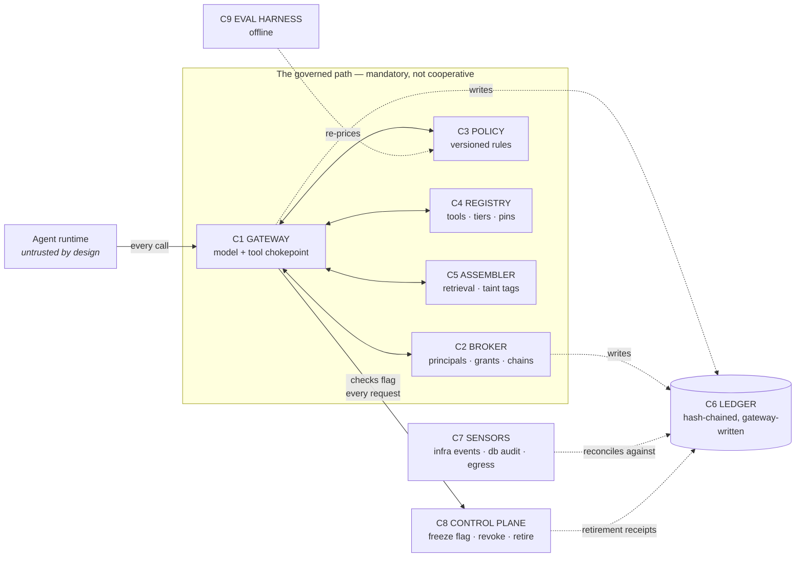

# AGCF Implementation Guide

**Companion to AGCF v0.9.4 · 28 July 2026 · Universal edition**

The catalogue answers *what must be true and how you'd prove it*. This document answers the question the catalogue deliberately doesn't: **what do you actually build, and in what order, so that one system satisfies many controls at once.**

It is written to be portable. Nothing here assumes a vendor, a cloud, or a stack — the components are named by role, the build specs are written against placeholders you fill in once (§6), and Part III is a library of ready-to-use prompts you can hand to an AI assistant, a contractor, or your own team to execute each piece inside *your* environment. A separate worked-example file shows the whole guide applied to one real self-hosted stack, for readers who want to see the shapes with the names filled in.

---

## Part I — The unified architecture

### 1. Why 100+ controls collapse into nine components

The catalogue is factored by *obligation* — that's what makes it auditable, and it's why it reads as a hundred separate things to do. Implementation is factored by *component*. The pivot between the two is the whole trick:

> **A control is a property of a component, not a project.**

Build the component with the property, and every control that names the property scores In Place together. Build controls one at a time without components and you get a hundred bolt-ons that drift apart. Nearly every failed governance programme is the second thing.

Nine components carry the entire runtime catalogue. Three domains (GOV, most of INV, parts of ASR) are process rather than software — they get a "paper plane" note at the end, and even INV turns out to be mostly *generatable* from the components.

| # | Component | One-line job | Domains it carries |
|---|---|---|---|
| C1 | **Gateway** | The one path every model call and tool call traverses | POL, parts of IDA, ACT, OBS |
| C2 | **Identity & Grant Broker** | Principals, credentials, grants — scoped, time-boxed, chainable | IDA, parts of ACT |
| C3 | **Policy Engine** | Written rules in evaluable, versioned form | POL |
| C4 | **Tool Registry** | The single source of what tools exist, pinned, tiered by reversibility | ING, ACT |
| C5 | **Context Assembler** | Retrieval with minimization, classification, and taint tags | DAT, ING |
| C6 | **Evidence Ledger** | Append-only, hash-chained, separate write path | OBS |
| C7 | **Independent Sensors** | Ground truth requiring zero actor cooperation | OBS, IRR |
| C8 | **Control Plane** | Freeze, revoke, retire, promote — the lifecycle verbs | ACT, IRR, INV |
| C9 | **Eval Harness** | Adaptive adversarial testing, drift monitoring (offline) | ASR |

None of these needs to be a product you buy. At small scale most are a schema, a proxy, a flag, and a cron job. What matters is that each *exists as a distinct thing with its property intact* — not which logo is on it.

### 2. The topology



The agent runtime sits *outside* the trust boundary. That is the design, not a compromise: the agent is the thing being governed, so nothing it hosts — including client-side hooks — can be a control.

### 3. The eight design rules

These are what make it *one* solution instead of a hundred. Every one is checkable in an afternoon.

**R1 — One mandatory path.** If an action can occur without traversing the gateway, it is not governed; it is at best observed. First act of implementation: enumerate every path from an agent to an effect (model API, tool call, shell, DB connection, HTTP egress) and for each one either close it or put it behind the gateway. The list of paths *is* the security architecture; everything else is decoration on it.

**R2 — Enforcement lives server-side; hooks are UX.** A client-side hook (an interceptor running inside the agent's own harness) reduces noise and improves ergonomics, but an agent that doesn't run the harness — or is prompted into not running it — bypasses it. Hooks may *deny early*; only the gateway may *permit*. Never let a hook be the last thing standing between intent and an irreversible effect.

**R3 — Everything is a grant.** Model call, tool call, data read, sub-agent spawn: one primitive, four bindings. Same schema, same time-to-live, same revocation semantics, same ledger record. The moment you have two authorization primitives you have a seam, and seams are where attribution dies. This rule is also what makes multi-agent delegation tractable — a sub-agent is just a grant with a parent (Spec 4).

**R4 — One ledger, cross-anchored.** Multiple stores are fine (operational events, task state, durable memory); multiple *sources of truth about what happened* are not. Every secondary store periodically anchors a digest of itself into the hash-chained ledger, so tampering with any store is detectable from one place.

**R5 — Deny is a state, not an error.** A freeze is a flag every component checks before acting, not an exception that propagates if you're lucky. Fail-closed means: gateway won't proxy, broker won't issue, registry resolves nothing, until the flag clears. A kill switch that works by *stopping* things fails exactly when the thing won't stop; a flag that everything *checks* fails safe.

**R6 — Attribution fails closed.** An action that cannot be matched to a principal and a grant is quarantined for human adjudication — never auto-assigned to the most probable actor to keep the pipeline moving. Guessed attribution is worse than none, because it is confidently wrong in the audit.

**R7 — Taint is metadata that never falls off.** Content carries its origin from ingestion through assembly to action arguments, and derivation propagates it. You cannot trace dataflow *through* a model — so you don't try; you taint at the granularity you can enforce (Spec 2).

**R8 — The registry reconciles everything.** Tools in the registry, principals in the broker, credentials in the secret store, spend in the billing data — periodically diffed against each other, discrepancies treated as findings. This one rule generates most of the INV domain for free: **inventory is a query against the components, not a spreadsheet someone maintains.**

### 4. Build order

Dependencies, not preferences:

```
C6 Ledger ──┐
C2 Broker ──┼──► C1 Gateway ──► C4 Registry tiers ──► C5 Taint ──► C9 Harness
C8 Freeze ──┘         │
                      └──► C7 Sensors (parallel, any time — earlier is better)
```

Ledger and broker before gateway (the gateway needs something to consult and somewhere to write). Freeze flag before you scale (retrofitting fail-closed into components that assumed fail-open is miserable). Sensors are parallel to everything and cheap — deploy them first if you want early wins; they are also how you will debug the rest.

### 5. Tier profiles — build vs. buy vs. configure

**T1 (Individual/Solo): configure, don't build.** The nine components exist as *product features* — pick tools that have them. The gateway is your agent product's permission system; the ledger is its session logs exported somewhere the agent can't write; the freeze flag is knowing where the off switch is and having tested it. The T1 deliverable is a one-page map of which product feature plays which component role, plus honest N/A justifications for the rest.

**T2 (Small–Mid): the proxy + broker pattern.** The tier this guide's specs target. Build C1/C2/C6/C8 thin (a proxy, a database schema, a flag), configure C4/C5 as data (a registry file, retrieval filters), and borrow C3/C7/C9 from infrastructure you already run (policy rules inside the broker; sensors from your container platform, database, and network layers; evals as scheduled jobs). Total surface: roughly one compose file's worth of services — deliberately within reach of one competent operator.

**T3 (Enterprise/Regulated): the same shapes, hardened.** Policy becomes an actual engine (OPA/Cedar-class) with change control; the ledger gets WORM storage or external anchoring; sensors feed a SIEM; the harness gets independence (a team that didn't build the agent). The architecture does not change between T2 and T3 — only the assurance around it does. That is the argument for building the shapes early.

---

## Part II — The five build specs

Fill these in once; every spec and every prompt below uses them:

| Placeholder | Your value is… | Examples of what fills it |
|---|---|---|
| `{{GATEWAY}}` | the chokepoint all model/tool calls traverse | an LLM proxy, an MCP gateway, an API gateway |
| `{{BROKER}}` | where principals, credentials and grants live | a Postgres schema, an IdP + token service |
| `{{REGISTRY}}` | the source of truth for tools/connectors | a YAML file, a database table, an admin UI |
| `{{LEDGER}}` | the append-only action record | an audit table, a WORM bucket, a log pipeline |
| `{{SENSOR}}` | telemetry the agent can't influence | container event streams, DB audit logs, egress logs |
| `{{MEMORY}}` | persistent agent state | vector store, session store, memory database |
| `{{RUNTIME}}` | where agents execute | containers, sandboxes, a desktop harness |

Each spec states what it closes, the design, and the **evidence artifact it produces** — because by this framework's own rules, a lift that doesn't produce evidence didn't happen.

---

### Spec 1 — Registry v2: reversibility becomes the axis

**Closes:** ACT-01 · ACT-02 · ING-04 · ING-05 · the granularity half of IDA-04

Most registries classify tools by *mutability* (read vs. execute). The governing axis is *blast*: what happens if this call is wrong, and can it be undone. Four classes, one schema change to `{{REGISTRY}}`:

```yaml
tools:
  send_email:
    tier: 2                    # 0 read-only · 1 reversible write · 2 irreversible · 3 destructive/admin
    pin:
      version: "1.4.2"
      sha256: "…"              # of the tool package/server — ING-04
    description_sha256: "…"    # hash of the MODEL-VISIBLE description; a changed
                               # description invalidates prior approval — ING-05
    limits:
      max_per_run: 5           # per-execution scope cap — ACT-06
    requires:
      - grant                  # tier ≥1: broker grant mandatory
      - taint_clean            # tier ≥2: no tainted inputs (Spec 2)
      - human_receipt          # tier 3: always gated — ACT-02
    rollback: "how to undo, or the compensating action if you can't"   # ACT-08
```

Enforcement rule, stated once and implemented in `{{GATEWAY}}`: **tier decides requirements; the tool name decides nothing.** A tool with no tier defaults to tier 3 until classified — unclassified means most-restricted, never least.

Migration is mechanical: every read-class tool → tier 0; every write-class tool → tier 2 *provisionally*; then a one-time review demotes the genuinely reversible ones to tier 1. Reviewing a registry's worth of tools is an afternoon — and that review, written down, is itself the ACT-01 evidence artifact.

**Evidence produced:** the registry with a tier on every tool, plus one gateway test showing a tier-3 call without approval is denied.

---

### Spec 2 — Taint: the honest version

**Closes:** ING-01 · ING-02 · progress on ING-06

The instinct is per-token dataflow tracking through the model. That is not buildable — a model is a mixing function; provenance does not survive it. Every real design concedes this and picks an enforceable granularity. Pick **turn and session**:

1. **Tag at ingestion.** Every context block gets an envelope that `{{ASSEMBLER}}`/`{{GATEWAY}}` attaches and the agent never controls:
```json
{ "content": "…",
  "origin": { "source": "ticket:8841", "class": "untrusted", "tainted": true } }
```
Sources are classified once, in config: tickets, web content, inbound mail, results from external-facing tools → `untrusted`. Your own registry, policy documents, operator input → `trusted`. Anything unlisted defaults to untrusted — the same most-restricted-by-default logic as Spec 1.

2. **Propagate coarsely.** If any tainted block entered the context this turn, the *turn* is tainted. If a tainted turn wrote to session state or `{{MEMORY}}`, that *entry* is tainted. Deliberately coarse — coarse is sound, and sound is what you can enforce. Fine granularity can come later; it only ever *relaxes* a correct coarse rule.

3. **Enforce at `{{GATEWAY}}`, never in the prompt.** Tainted turn + tier ≥2 action → deny, with an escalation path: page a human, capture their approval, convert it to a recorded receipt. This composes with the override philosophy in HUM-11 — you are not blocking the human; you are refusing to let *content* authorize an irreversible act without one.

4. **Persistence is the point.** The attack class that defeats turn-level taint is the *sleeper*: inject on turn 3, activate on turn 20. (One field red-team run measured a 100% activation rate — 20 of 20 — for exactly this class before enforcement existed.) The countermeasure is **session stickiness**: once tainted, a session stays tainted until context is cleared or a human clears the flag with a receipt. One bit of state defeats the whole class.

**Evidence produced:** an injection eval run before and after enforcement. The activation rate moving from N/N to 0/N-without-a-receipt is simultaneously your ING-02 and ASR-03 evidence — the single best artifact this programme will produce.

---

### Spec 3 — Freeze: the kill switch as a state

**Closes:** ACT-07 · the containment half of IRR-03

Invert the usual design per R5 — from "stop things" to "everything checks a flag":

```
freeze table (in {{BROKER}}):  scope · reason · set_by · set_at · cleared_at
  scopes: all | principal:<id> | tool:<name> | tier>=N | connector:<name>
```

Checked on every request by: `{{GATEWAY}}` (matching scope → refuse, fail closed) · `{{BROKER}}` (frozen scope issues nothing; live grants matching scope are revoked on set) · `{{RUNTIME}}`'s platform controls (an `all` freeze flips container/platform permissions to read-only) · client hooks too, for fast UX — per R2, never as the enforcement.

One CLI verb: `agctl freeze --scope tier>=2 --reason "…"` — which **writes the freeze to `{{LEDGER}}` first, then flips the flag.** The evidence of the stop precedes the stop; an emergency that erases its own record isn't contained, it's hidden.

**Evidence produced:** a quarterly drill record with measured time-to-stop per scope. The control text says "tested, not just designed" — the drill *is* the control.

---

### Spec 4 — Delegation chains: attenuation-only grants

**Closes:** IDA-03 · ACT-10 · the authentication half of ING-08

The multi-agent problem stated three ways — inter-agent delegation, sub-agent permission inheritance, agent-to-agent trust — is one mechanism. Grants in `{{BROKER}}` grow three columns and one invariant:

```
grants: … parent_grant_id · depth · (existing: scope, ttl, principal)

INVARIANT (attenuation-only — enforced at issue time, macaroon-style):
  child.scope        ⊆ parent.scope          ← scope-intersection; reject if empty
  child.ttl          ≤ parent.remaining_ttl
  child.tier_ceiling ≤ parent.tier_ceiling
  child.depth        = parent.depth + 1 ≤ MAX_DEPTH   (start at 2)
  fan-out: open children per parent ≤ MAX_CHILDREN     (start at 3)
REVOCATION CASCADE: revoking a parent revokes its subtree.
```

Three consequences, each closing a named gap:

- **"Sub-agent of a sub-agent, acting on whose authority?" gets a literal answer:** walk `parent_grant_id` to the root; the root's principal was minted by a human through the sanctioned bootstrap path. Action records carry the full chain — IDA-03.
- **A sub-agent can never gain privileges its caller lacked** — not as policy but as an invariant the broker cannot violate. ACT-10.
- **Inter-agent messages ride grants as envelopes:** agent B accepts input from agent A only when accompanied by a live grant naming A — which authenticates the channel (ING-08's first half). The *content* of A's message remains untrusted per Spec 2: a message from another agent is a tainted source like any other. **Authentication and trust deliberately do not travel together.**

Attenuation-only is the entire trick, and its enforcement primitive — scope intersection — is something most grant systems already have or can add in a day. This is a small lift wearing a research problem's clothes.

**Evidence produced:** a test where a child grant requests scope exceeding its parent and is rejected at issue; one action record showing a depth-2 chain resolving to a human root.

---

### Spec 5 — Lifecycle: retire, and anchor the second store

**Closes:** IRR-07 · completes OBS-03 across all stores · most of INV via R8

**Retire.** One verb, transactional, ordered so evidence survives:

```
agctl retire <principal>
  1. write retirement receipt to {{LEDGER}}      (evidence first, always)
  2. revoke all credentials; cascade-revoke all grants (Spec 4 subtrees included)
  3. snapshot {{MEMORY}} + session state → archive; delete per retention policy
  4. remove {{REGISTRY}} bindings and connector allowlist entries
  5. verify: a query for live artifacts of <principal> returns EMPTY — the query IS the checklist
  6. dependency check: anything routing to this principal? → page a human, don't silently orphan
```

Step 5 is why this is a workflow and not a wiki page: retirement is *proven by a query returning empty*, not by someone remembering six steps.

**Anchor the secondary stores.** Per R4: an hourly job writes `sha256(store segment since last anchor)` into `{{LEDGER}}` for every store that isn't the ledger itself — operational logs, task state, sensor output files. Each store inherits the ledger's tamper evidence transitively: forging any of them now requires also breaking a hash chain in a place the agent can't write. One cron job per store. A sensor whose own output is tamperable is only half a sensor.

**Inventory falls out.** With broker + registry + retire in place, the inventory domain becomes a *report*: principals ⨝ grants ⨝ registry bindings ⨝ per-principal spend, diffed weekly (R8). An agent appearing in the bill but not the broker is shadow-AI discovery (INV-06), automated. Most organizations score zero on inventory only because nobody wrote the query.

**Evidence produced:** one executed retirement with its receipt and empty-verify; the first weekly reconciliation report *with its discrepancies* — a reconciliation that finds nothing on its first run wasn't looking.

---

## Part III — The prompt library

Each prompt is written to be pasted into an AI coding assistant working inside your environment (or handed to an engineer as a task brief). Replace `{{…}}` placeholders from the table in Part II. Every prompt ends by demanding the evidence artifact — keep that line; it is the difference between "merged" and "done."

### P0 — Path inventory (run this first; it is rule R1)

> Inventory every path by which an AI agent or assistant in this environment can cause an effect outside its own process. Examine: model API access (direct and proxied), tool/function/MCP calls, shell access, database connections, filesystem mounts, HTTP egress, email/messaging send paths, CI/CD triggers, and any credentials in environment variables or config that reach beyond the runtime. For each path found, record: (1) what traverses it, (2) whether it passes through {{GATEWAY}} or bypasses it, (3) what identity it uses, (4) whether its actions land in {{LEDGER}}. Output a table with a BYPASS/GOVERNED/OBSERVED-ONLY verdict per path. Do not fix anything yet — the deliverable is the honest list.

### P1 — Component mapping

> Here is a nine-component reference architecture: [paste Part I §1 table]. Map each component to what exists in this environment, marking each PRESENT / PARTIAL / ABSENT with one sentence of evidence (a file, a table, a config — not an intention). For PARTIAL, state exactly what property is missing using the component's one-line job as the bar. Output the mapping table plus a dependency-ordered list of the ABSENT and PARTIAL items per the build-order graph: ledger and broker before gateway, freeze before scale, sensors any time.

### P2 — Registry tiering (Spec 1)

> Our tool definitions live in {{REGISTRY}}. Add a reversibility tier to every tool: 0 read-only, 1 reversible write, 2 irreversible, 3 destructive/admin. Also add: a version+hash pin per tool, a hash of the model-visible description (a changed description must invalidate approval), an optional max_per_run limit, and a rollback/compensating-action note for tiers 1–2. Migrate existing entries: read-class → 0, write-class → 2 provisionally, then list the write-class tools with your recommended demotions to tier 1 and reasoning for my review. Enforce in {{GATEWAY}}: tier decides requirements (tier ≥1 requires a live grant from {{BROKER}}; tier 3 requires recorded human approval); an unclassified tool is treated as tier 3. Evidence required: the migrated registry, plus a test proving a tier-3 call without approval is denied and the denial is written to {{LEDGER}}.

### P3 — Taint tagging (Spec 2)

> Implement coarse-grained taint tracking. (1) Create a source-classification config listing every content source reaching agent context, each marked trusted/untrusted; unlisted sources default untrusted. (2) Wrap every context block entering the model with an origin envelope {source, class, tainted} attached outside the agent's control. (3) Turn-level propagation: any tainted block in context marks the turn tainted; session-level stickiness: a tainted turn marks the session tainted until context is cleared or a human clears it with a recorded receipt; any write to {{MEMORY}} from a tainted turn marks that entry tainted. (4) Enforce in {{GATEWAY}}: tainted state + tier ≥2 action → deny and page for human approval; the approval converts to a receipt in {{LEDGER}}. Do NOT attempt token-level dataflow tracking through the model. Evidence required: an injection test that plants an instruction in an untrusted source on an early turn and attempts an irreversible action many turns later — reported as activation rate over N attempts, before and after enforcement.

### P4 — Freeze flag (Spec 3)

> Implement a fail-closed freeze mechanism. A freeze table in {{BROKER}} with scopes: all, principal:<id>, tool:<name>, tier>=N, connector:<name>. Every component checks it before acting: {{GATEWAY}} refuses matching requests, {{BROKER}} stops issuing and revokes live grants in scope, platform-level permissions flip to read-only on an 'all' freeze. Build a CLI verb (freeze/unfreeze) that writes the freeze record to {{LEDGER}} BEFORE flipping the flag. Nothing may treat the flag as advisory. Evidence required: a drill transcript — set each scope, measure time until effects stop, confirm the ledger record predates the stop, unfreeze, confirm recovery.

### P5 — Delegation chains (Spec 4)

> Extend the grants schema in {{BROKER}} with parent_grant_id and depth. Enforce attenuation-only at issue time: child scope must be a subset of parent scope (compute the intersection; reject if empty or widening), child TTL ≤ parent's remaining TTL, child tier ceiling ≤ parent's, depth ≤ 2, open children per parent ≤ 3. Revoking a parent cascades to its subtree. Action records must carry the full chain to the root principal. Inter-agent input is accepted only when accompanied by a live grant naming the sending agent — and is still classified untrusted content under the taint rules. Evidence required: a rejected widening attempt at issue time, and one action record showing a depth-2 chain resolving to a human-bootstrapped root.

### P6 — Retirement + anchoring (Spec 5)

> Build 'retire <principal>' as a transactional workflow: write a retirement receipt to {{LEDGER}} first; revoke all credentials and cascade-revoke grants; snapshot then archive {{MEMORY}} and session state per retention policy; remove {{REGISTRY}} and connector bindings; verify with a query that must return zero live artifacts; page a human if anything still routes to the principal. Separately, add an hourly anchoring job: for each secondary store (operational logs, task state, sensor output), write a digest of the segment since the last anchor into {{LEDGER}}. Evidence required: one executed retirement (receipt + empty verify), and one demonstrated tamper detection — modify a byte in an anchored store copy and show the next reconciliation flags it.

### P7 — Reconciliation report (rule R8)

> Build a weekly reconciliation: principals in {{BROKER}} ⨝ live grants ⨝ {{REGISTRY}} bindings ⨝ per-principal model spend ⨝ credentials in the secret store. Flag: spend with no principal (shadow agent), principals with no activity for 30 days (retirement candidates), grants whose scope was never exercised (over-provisioning), credentials with no owning principal (orphans). Evidence required: the first report with its discrepancies listed — an empty first report means the join logic is wrong, not that the environment is clean.

### P8 — Assessment to plan

> Here is our completed AGCF assessment export [attach the saved JSON]. Group every Must Implement and Develop finding by which of the nine components (Part I §1) would close it, using the domain-to-component mapping. Order components by the build-order graph. For each, output: controls closed, which build spec applies (Specs 1–5) or a one-paragraph design sketch if none does, the evidence artifact that will prove completion, and a rough effort class (config / days / design work). Flag any control no component closes — those are the genuinely novel work and should be named as such, not buried in the list.

### Using the prompts well

Run P0 and P1 before anything else, and resist fixing during discovery — the honest list is the deliverable. Then P4 (freeze) and P2 (tiers) in either order, P3 alone in the middle (it is the only one with design risk), P5–P7 after. Feed each prompt's evidence artifact into your assessment file as the control's evidence line — the assessment and the build then stay one artifact, and rerunning the assessment quarterly against the saved JSON gives you the programme's actual trajectory rather than its intended one.

---

## Part IV — Ninety days, sequenced

Definition of done for every line: *the evidence artifact exists* — not "the code merged."

**Days 1–14 — flags, tiers, anchors** *(mechanical, no design risk)*
Freeze flag + drill #1 (P4) → ACT-07 · registry tiers, provisional (P2) → ACT-01/02 · anchoring cron (P6, second half) → OBS-03 complete · a policy_version stamp on decision records → POL-07.

**Days 15–45 — the taint lift** *(the one with design risk; it gets the middle third alone)*
Source classification, envelopes, session stickiness, gateway enforcement (P3) → ING-01/02 · before/after injection eval → ASR-03 · in parallel if hands allow: default-deny egress for agent runtimes → ACT-04.

**Days 46–75 — chains and lifecycle**
Delegation columns + attenuation invariant + cascade (P5) → IDA-03, ACT-10, ING-08½ · retire verb + one real retirement (P6) → IRR-07 · per-principal rate/spend caps at the gateway → ACT-05/06.

**Days 76–90 — close the loop, then stop building**
Weekly reconciliation (P7) → INV-01/02/06/08 · injection eval as a scheduled job with a paging threshold → ASR-09 · approval/override-rate metric from existing gate data → HUM-02 · containment playbook written *from drill #1's transcript*, not from imagination → IRR-03 · rerun the assessment and diff against the saved baseline.

Then the paper plane, which takes one honest afternoon precisely because everything above exists: GOV-01 (a name), GOV-02 (a page), INV as the standing report from P7, and the DAT source-classification doc — which you already wrote as P3's config; now it is also your data-boundary statement.

## Part V — What deliberately isn't here

No SIEM migration, no policy-engine product rollout, no decentralized-identifier agent identity, no telemetry-standard adoption. At small-to-mid scale each of those is a quarter of integration work purchasing assurance the five specs deliver in days. Revisit when: an enterprise customer demands formal evidence packs (then invest in OBS-08 export formats), NIST's agent control overlays publish (then re-map C1–C5 against them), or the OpenTelemetry GenAI conventions stabilize (then adopt that span schema rather than maintaining your own). The framework document's currency section (§9) is the standing tripwire for all three.
